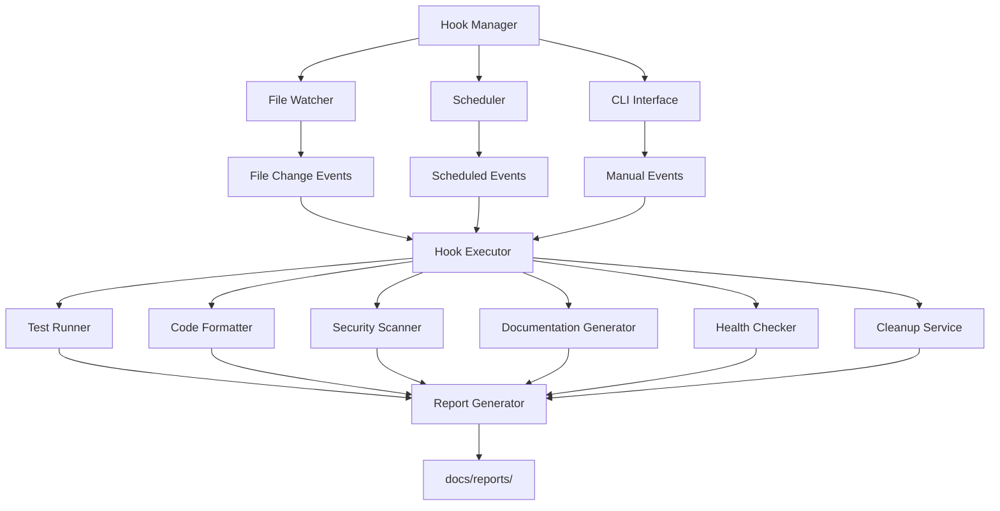

# Agent Hooks Design Document

## Overview

Agent Hooks sistemi, Collective Memory projesinde geliştirme sürecini otomatikleştiren event-driven bir mimari kullanır. Sistem, dosya değişikliklerini izleyen file watchers, zamanlanmış görevler için scheduler ve manuel tetikleme için CLI interface'den oluşur.

## Architecture



## Components and Interfaces

### 1. Hook Manager (hook-manager.py)

**Responsibilities:**
- Hook konfigürasyonunu yükleme ve yönetme
- File watcher'ları başlatma ve durdurma
- Scheduler'ı yönetme
- Hook execution'ı koordine etme

**Key Methods:**
```python
class HookManager:
    def __init__(self, hooks_config_path: str)
    def load_hooks(self) -> None
    def start(self) -> None
    def stop(self) -> None
    def execute_hook(self, hook_id: str, context: dict) -> None
```

### 2. File Watcher (FileChangeHandler)

**Responsibilities:**
- Dosya sistem değişikliklerini izleme
- Pattern matching ile ilgili dosyaları filtreleme
- Hook tetikleme

**Implementation:**
```python
class FileChangeHandler(FileSystemEventHandler):
    def on_modified(self, event) -> None
    def trigger_file_save_hooks(self, file_path: str) -> None
```

### 3. Test Runner (test-runner.py)

**Responsibilities:**
- Python ve JavaScript testlerini çalıştırma
- Test sonuçlarını raporlama
- İlgili test dosyalarını bulma

**Key Methods:**
```python
class TestRunner:
    def run_python_tests(self, changed_file: str) -> dict
    def run_javascript_tests(self, changed_file: str) -> dict
    def find_related_test_file(self, source_file: str) -> Path
```

### 4. Hook Actions

Her hook action'ı ayrı bir method olarak implement edilir:

```python
def run_tests_action(self, config: dict, context: dict) -> None
def format_code_action(self, config: dict, context: dict) -> None
def security_scan_action(self, config: dict, context: dict) -> None
def generate_test_report_action(self, config: dict, context: dict) -> None
def health_check_action(self, config: dict, context: dict) -> None
def cleanup_action(self, config: dict, context: dict) -> None
```

## Data Models

### Hook Configuration Schema

```json
{
  "id": "string",
  "name": "string",
  "description": "string",
  "trigger": {
    "type": "file_save|scheduled|manual",
    "patterns": ["string"],
    "schedule": "string",
    "button_text": "string"
  },
  "enabled": "boolean",
  "actions": [
    {
      "type": "string",
      "config": "object"
    }
  ]
}
```

### Report Data Schema

```json
{
  "timestamp": "ISO8601",
  "hook_id": "string",
  "hook_name": "string",
  "trigger_type": "string",
  "context": "object",
  "results": [
    {
      "action_type": "string",
      "status": "success|error|warning",
      "duration_ms": "number",
      "output": "string",
      "error": "string"
    }
  ]
}
```

## Error Handling

### Error Categories

1. **Configuration Errors**
   - Invalid JSON in hooks.json
   - Missing required fields
   - Invalid trigger patterns

2. **Runtime Errors**
   - File system permission errors
   - Command execution failures
   - Network connectivity issues

3. **Resource Errors**
   - Disk space limitations
   - Memory constraints
   - Process limits

### Error Recovery Strategies

```python
# Graceful degradation
try:
    execute_hook_action(action)
except CriticalError:
    disable_hook_temporarily()
    notify_user_in_turkish()
except RecoverableError:
    retry_with_backoff()
except ResourceError:
    queue_for_later_execution()
```

### Turkish Error Messages

```python
ERROR_MESSAGES = {
    'file_not_found': 'Dosya bulunamadı: {filename}',
    'permission_denied': 'Dosya erişim izni reddedildi: {filename}',
    'command_failed': 'Komut çalıştırma başarısız: {command}',
    'timeout_exceeded': 'İşlem zaman aşımına uğradı: {timeout}s',
    'disk_space_low': 'Disk alanı yetersiz: {available}GB kaldı',
    'memory_usage_high': 'Bellek kullanımı yüksek: %{percentage}'
}
```

## Testing Strategy

### Unit Tests

```python
class TestHookManager(unittest.TestCase):
    def test_load_hooks_valid_config(self)
    def test_load_hooks_invalid_config(self)
    def test_execute_hook_success(self)
    def test_execute_hook_failure(self)
    def test_file_watcher_pattern_matching(self)
```

### Integration Tests

```python
class TestHookIntegration(unittest.TestCase):
    def test_file_save_triggers_test_hook(self)
    def test_scheduled_hook_execution(self)
    def test_manual_hook_execution(self)
    def test_multiple_hooks_parallel_execution(self)
```

### End-to-End Tests

```python
class TestHookE2E(unittest.TestCase):
    def test_complete_workflow_python_file_save(self)
    def test_complete_workflow_dependency_update(self)
    def test_complete_workflow_scheduled_cleanup(self)
```

## Performance Considerations

### Resource Usage Targets

- **Memory Usage**: <50MB for hook manager process
- **CPU Usage**: <5% during idle monitoring
- **File System Monitoring**: <10ms response time for file changes
- **Hook Execution**: <100ms overhead per hook trigger

### Optimization Strategies

1. **Lazy Loading**: Hook actions yalnızca gerektiğinde yüklenir
2. **Debouncing**: Rapid file changes için debounce mechanism
3. **Parallel Execution**: Bağımsız hook'lar paralel çalıştırılır
4. **Resource Pooling**: Process pool for heavy operations

### Monitoring and Metrics

```python
class HookMetrics:
    def track_execution_time(self, hook_id: str, duration: float)
    def track_memory_usage(self, process_id: int, memory_mb: float)
    def track_error_rate(self, hook_id: str, error_count: int)
    def generate_performance_report(self) -> dict
```

## Security Considerations

### Input Validation

- File path sanitization
- Command injection prevention
- Configuration schema validation

### Process Isolation

- Subprocess execution with timeout
- Resource limits for child processes
- Secure temporary file handling

### Access Control

- File system permission checks
- User context validation
- Audit logging for sensitive operations

## Deployment and Configuration

### Installation Requirements

```bash
pip install watchdog psutil
```

### Configuration Management

- Environment-specific hook configurations
- User-level vs project-level settings
- Configuration validation on startup

### Monitoring and Logging

```python
import logging

logging.basicConfig(
    level=logging.INFO,
    format='%(asctime)s - %(name)s - %(levelname)s - %(message)s',
    handlers=[
        logging.FileHandler('docs/reports/hook-logs/hooks.log'),
        logging.StreamHandler()
    ]
)
```

## Future Enhancements

### Planned Features

1. **Web Dashboard**: Browser-based hook management interface
2. **Remote Hooks**: Execute hooks on remote development servers
3. **Hook Marketplace**: Shareable hook configurations
4. **Advanced Scheduling**: Cron-like scheduling with more flexibility
5. **Integration APIs**: Webhooks for external service integration

### Scalability Considerations

- Multi-project hook management
- Distributed hook execution
- Cloud-based hook orchestration
- Team-wide hook sharing and synchronization