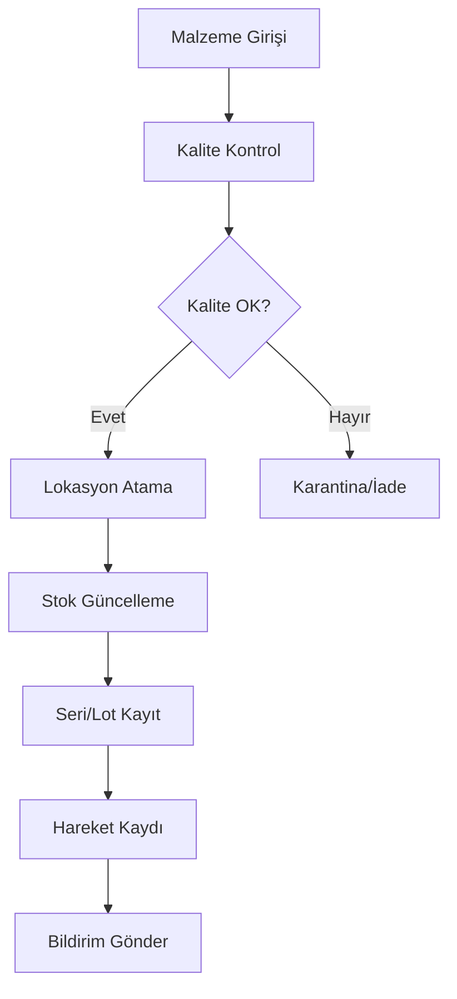
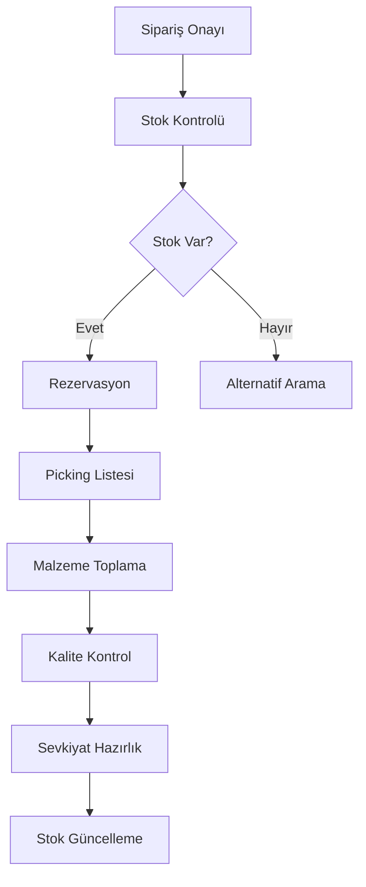
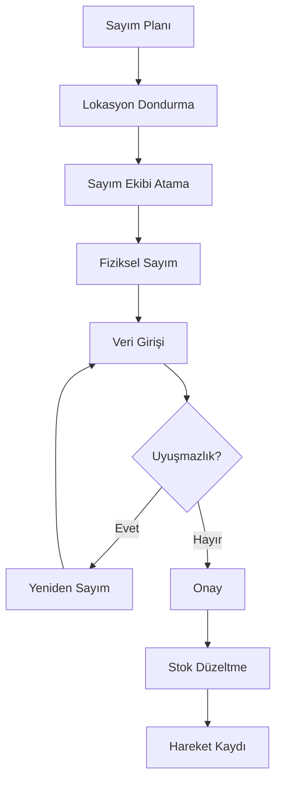

# Context7 ERP System - Stok Yönetimi Modülü Dokümantasyonu

**Modül Kodu:** INV-001  
**Modül Adı:** Inventory Management (Stok Yönetimi)  
**Versiyon:** v2.2.0-glassmorphism-enhanced  
**Son Güncelleme:** 13 Haziran 2025  
**Durum:** ✅ Production Ready (95% Tamamlandı)  
**Öncelik:** 🔥 Kritik (Temel İş Süreci)  
**Tahmini Geliştirme Süresi:** 120 saat  

---

## 📋 Modül Genel Bakış

Stok Yönetimi modülü, işletmenin tüm fiziksel varlıklarının takibini, kontrolünü ve optimizasyonunu sağlayan temel ERP bileşenidir. Bu modül, hammadde girişinden nihai ürün sevkiyatına kadar tüm stok hareketlerini yönetir.

### 🎯 Temel Amaçlar
- Gerçek zamanlı stok seviyesi takibi
- Otomatik yeniden sipariş noktası uyarıları
- Çoklu depo ve lokasyon yönetimi
- Stok maliyetlendirme ve değerleme
- FIFO/LIFO/Weighted Average maliyet yöntemleri
- Seri/lot numarası takibi
- Stok sayım ve uyuşmazlık yönetimi

---

## 🏗️ Modül Mimarisi

### Ana Bileşenler
1. **Depo Yönetimi** (Warehouse Management)
2. **Ürün/Malzeme Tanımları** (Product/Material Definitions)
3. **Stok Hareketleri** (Inventory Movements)
4. **Stok Seviyesi Takibi** (Stock Level Monitoring)
5. **Lokasyon Yönetimi** (Location Management)
6. **Seri/Lot Takibi** (Serial/Lot Tracking)
7. **Stok Sayım** (Physical Inventory)
8. **Risk Yönetimi** (Risk Management)
9. **Dinamik Fiyatlandırma** (Dynamic Pricing)
10. **İskonto Tanımları** (Discount Definitions)

---

## 🗄️ Veritabanı Modelleri

### 1. Warehouse (Depo) Modeli
```python
class Warehouse(models.Model):
    warehouse_code = models.CharField(max_length=20, unique=True)
    name = models.CharField(max_length=100)
    address = models.TextField()
    manager = models.ForeignKey(User, on_delete=models.SET_NULL, null=True)
    capacity = models.DecimalField(max_digits=15, decimal_places=2)
    warehouse_type = models.CharField(max_length=50)  # Main, Transit, Quarantine
    temperature_controlled = models.BooleanField(default=False)
    security_level = models.CharField(max_length=20)
    operating_hours = models.CharField(max_length=100)
    is_active = models.BooleanField(default=True)
    created_at = models.DateTimeField(auto_now_add=True)
    updated_at = models.DateTimeField(auto_now=True)
```

### 2. Location (Lokasyon) Modeli
```python
class Location(models.Model):
    location_code = models.CharField(max_length=30, unique=True)
    warehouse = models.ForeignKey(Warehouse, on_delete=models.CASCADE)
    aisle = models.CharField(max_length=10)
    shelf = models.CharField(max_length=10)
    bin = models.CharField(max_length=10)
    zone = models.ForeignKey('Zone', on_delete=models.SET_NULL, null=True)
    capacity = models.DecimalField(max_digits=10, decimal_places=2)
    current_usage = models.DecimalField(max_digits=10, decimal_places=2, default=0)
    location_type = models.CharField(max_length=30)  # Storage, Picking, QC
    barcode = models.CharField(max_length=50, blank=True)
    is_active = models.BooleanField(default=True)
```

### 3. Zone (Bölge) Modeli
```python
class Zone(models.Model):
    zone_name = models.CharField(max_length=50)
    zone_code = models.CharField(max_length=20, unique=True)
    warehouse = models.ForeignKey(Warehouse, on_delete=models.CASCADE)
    zone_type = models.CharField(max_length=30)  # Fast-moving, Slow-moving, Hazardous
    temperature_range = models.CharField(max_length=50, blank=True)
    special_conditions = models.TextField(blank=True)
    access_level = models.CharField(max_length=20)
    is_active = models.BooleanField(default=True)
```

### 4. ProductVariant (Ürün Varyantı) Modeli
```python
class ProductVariant(models.Model):
    product = models.ForeignKey(Product, on_delete=models.CASCADE)
    variant_sku = models.CharField(max_length=50, unique=True)
    color = models.ForeignKey('Color', on_delete=models.SET_NULL, null=True)
    size = models.ForeignKey('Size', on_delete=models.SET_NULL, null=True)
    brand = models.ForeignKey('Brand', on_delete=models.SET_NULL, null=True)
    model = models.ForeignKey('ProductModel', on_delete=models.SET_NULL, null=True)
    barcode = models.CharField(max_length=50, unique=True)
    additional_cost = models.DecimalField(max_digits=10, decimal_places=2, default=0)
    weight = models.DecimalField(max_digits=8, decimal_places=3, null=True)
    dimensions = models.CharField(max_length=100, blank=True)  # LxWxH
    is_active = models.BooleanField(default=True)
```

### 5. StockLevel (Stok Seviyesi) Modeli
```python
class StockLevel(models.Model):
    product = models.ForeignKey(Product, on_delete=models.CASCADE)
    variant = models.ForeignKey(ProductVariant, on_delete=models.CASCADE, null=True)
    warehouse = models.ForeignKey(Warehouse, on_delete=models.CASCADE)
    location = models.ForeignKey(Location, on_delete=models.SET_NULL, null=True)
    available_quantity = models.DecimalField(max_digits=15, decimal_places=4)
    reserved_quantity = models.DecimalField(max_digits=15, decimal_places=4, default=0)
    blocked_quantity = models.DecimalField(max_digits=15, decimal_places=4, default=0)
    minimum_stock_level = models.DecimalField(max_digits=10, decimal_places=4)
    maximum_stock_level = models.DecimalField(max_digits=10, decimal_places=4)
    reorder_point = models.DecimalField(max_digits=10, decimal_places=4)
    optimal_stock_level = models.DecimalField(max_digits=10, decimal_places=4)
    last_movement_date = models.DateTimeField()
    average_daily_consumption = models.DecimalField(max_digits=10, decimal_places=4, default=0)
    lead_time_days = models.IntegerField(default=7)
    last_updated = models.DateTimeField(auto_now=True)
```

### 6. SerialLotTracking (Seri/Lot Takibi) Modeli
```python
class SerialLotTracking(models.Model):
    TRACKING_TYPE_CHOICES = [
        ('serial', 'Serial Number'),
        ('lot', 'Lot Number'),
        ('both', 'Both Serial and Lot'),
    ]
    
    product = models.ForeignKey(Product, on_delete=models.CASCADE)
    tracking_type = models.CharField(max_length=10, choices=TRACKING_TYPE_CHOICES)
    serial_number = models.CharField(max_length=100, blank=True)
    lot_number = models.CharField(max_length=100, blank=True)
    manufacturing_date = models.DateField()
    expiry_date = models.DateField(null=True, blank=True)
    supplier = models.ForeignKey(Supplier, on_delete=models.SET_NULL, null=True)
    supplier_lot_number = models.CharField(max_length=100, blank=True)
    current_location = models.ForeignKey(Location, on_delete=models.SET_NULL, null=True)
    status = models.CharField(max_length=20)  # Available, Sold, Blocked, Expired
    quality_status = models.CharField(max_length=20)  # Passed, Failed, Pending
    notes = models.TextField(blank=True)
    created_at = models.DateTimeField(auto_now_add=True)
```

### 7. StockAdjustment (Stok Düzeltme) Modeli
```python
class StockAdjustment(models.Model):
    ADJUSTMENT_TYPE_CHOICES = [
        ('physical_count', 'Physical Count'),
        ('damage', 'Damage'),
        ('theft', 'Theft'),
        ('system_error', 'System Error'),
        ('write_off', 'Write Off'),
        ('found', 'Found Items'),
    ]
    
    adjustment_number = models.CharField(max_length=50, unique=True)
    adjustment_date = models.DateTimeField()
    adjustment_type = models.CharField(max_length=20, choices=ADJUSTMENT_TYPE_CHOICES)
    product = models.ForeignKey(Product, on_delete=models.CASCADE)
    warehouse = models.ForeignKey(Warehouse, on_delete=models.CASCADE)
    location = models.ForeignKey(Location, on_delete=models.SET_NULL, null=True)
    book_quantity = models.DecimalField(max_digits=15, decimal_places=4)
    physical_quantity = models.DecimalField(max_digits=15, decimal_places=4)
    variance_quantity = models.DecimalField(max_digits=15, decimal_places=4)
    unit_cost = models.DecimalField(max_digits=15, decimal_places=4)
    total_value_impact = models.DecimalField(max_digits=15, decimal_places=2)
    reason = models.TextField()
    approved_by = models.ForeignKey(User, on_delete=models.PROTECT)
    approval_date = models.DateTimeField()
    created_by = models.ForeignKey(User, on_delete=models.PROTECT, related_name='created_adjustments')
    created_at = models.DateTimeField(auto_now_add=True)
```

### 8. DynamicPricing (Dinamik Fiyatlandırma) Modeli
```python
class DynamicPricing(models.Model):
    PRICING_TYPE_CHOICES = [
        ('customer_specific', 'Customer Specific'),
        ('volume_discount', 'Volume Discount'),
        ('seasonal', 'Seasonal Pricing'),
        ('promotional', 'Promotional Pricing'),
    ]
    
    product = models.ForeignKey(Product, on_delete=models.CASCADE)
    customer = models.ForeignKey(Customer, on_delete=models.CASCADE, null=True, blank=True)
    pricing_type = models.CharField(max_length=20, choices=PRICING_TYPE_CHOICES)
    base_price = models.DecimalField(max_digits=15, decimal_places=4)
    special_price = models.DecimalField(max_digits=15, decimal_places=4)
    min_quantity = models.DecimalField(max_digits=10, decimal_places=2, default=1)
    max_quantity = models.DecimalField(max_digits=10, decimal_places=2, null=True, blank=True)
    discount_percentage = models.DecimalField(max_digits=5, decimal_places=2, default=0)
    currency = models.CharField(max_length=3, default='TRY')
    valid_from = models.DateTimeField()
    valid_to = models.DateTimeField()
    is_active = models.BooleanField(default=True)
    created_at = models.DateTimeField(auto_now_add=True)
```

---

## 🔧 API Endpoints

### Depo Yönetimi Endpoints
```http
GET     /api/v1/inventory/warehouses/                  # Depo listesi
POST    /api/v1/inventory/warehouses/                  # Yeni depo oluştur
GET     /api/v1/inventory/warehouses/{id}/             # Depo detayı
PUT     /api/v1/inventory/warehouses/{id}/             # Depo güncelle
DELETE  /api/v1/inventory/warehouses/{id}/             # Depo sil
GET     /api/v1/inventory/warehouses/{id}/locations/   # Depo lokasyonları
GET     /api/v1/inventory/warehouses/{id}/stock-levels/ # Depo stok seviyeleri
```

### Stok Seviyesi Takibi Endpoints
```http
GET     /api/v1/inventory/stock-levels/                # Tüm stok seviyeleri
GET     /api/v1/inventory/stock-levels/low-stock/      # Düşük stoklar
GET     /api/v1/inventory/stock-levels/reorder-alerts/ # Yeniden sipariş uyarıları
GET     /api/v1/inventory/stock-levels/product/{id}/   # Ürün stok seviyeleri
PUT     /api/v1/inventory/stock-levels/{id}/reserve/   # Stok rezerve et
PUT     /api/v1/inventory/stock-levels/{id}/release/   # Rezervasyonu kaldır
```

### Stok Hareketleri Endpoints
```http
GET     /api/v1/inventory/movements/                   # Stok hareketleri
POST    /api/v1/inventory/movements/                   # Yeni hareket kaydet
GET     /api/v1/inventory/movements/product/{id}/      # Ürün hareketleri
GET     /api/v1/inventory/movements/warehouse/{id}/    # Depo hareketleri
GET     /api/v1/inventory/movements/between-dates/     # Tarih aralığı hareketleri
```

### Stok Sayım Endpoints
```http
GET     /api/v1/inventory/adjustments/                 # Stok düzeltmeleri
POST    /api/v1/inventory/adjustments/                 # Yeni düzeltme
GET     /api/v1/inventory/adjustments/{id}/            # Düzeltme detayı
PUT     /api/v1/inventory/adjustments/{id}/approve/    # Düzeltme onayla
GET     /api/v1/inventory/physical-count/              # Sayım listesi
POST    /api/v1/inventory/physical-count/start/        # Sayım başlat
PUT     /api/v1/inventory/physical-count/{id}/complete/ # Sayım tamamla
```

### Seri/Lot Takibi Endpoints
```http
GET     /api/v1/inventory/serial-lot/                  # Seri/lot listesi
POST    /api/v1/inventory/serial-lot/                  # Yeni seri/lot kaydet
GET     /api/v1/inventory/serial-lot/{id}/             # Seri/lot detayı
GET     /api/v1/inventory/serial-lot/trace/{serial}/   # Seri numarası takibi
GET     /api/v1/inventory/serial-lot/expiring/         # Süresi dolan ürünler
PUT     /api/v1/inventory/serial-lot/{id}/move/        # Lokasyon değiştir
```

### Raporlama Endpoints
```http
GET     /api/v1/inventory/reports/stock-valuation/     # Stok değerleme raporu
GET     /api/v1/inventory/reports/abc-analysis/        # ABC analizi
GET     /api/v1/inventory/reports/slow-moving/         # Yavaş hareket eden stok
GET     /api/v1/inventory/reports/aging/               # Stok yaşlandırma
GET     /api/v1/inventory/reports/turnover/            # Stok devir hızı
```

---

## 🎨 Kullanıcı Arayüzü Gereksinimleri

### Ana Stok Dashboard'u
- **Stok Özet Kartları**: Toplam stok değeri, düşük stok uyarıları, son hareketler
- **Grafik Göstergeler**: Stok seviyesi trendleri, ABC analizi pasta grafiği
- **Hızlı Erişim**: Stok sayımı başlat, acil sipariş oluştur, hareket kaydı
- **Uyarı Paneli**: Kritik stok seviyeleri, süresi dolan ürünler, sayım gerekenleri

### Stok Listesi Sayfası
- **Gelişmiş Filtreleme**: Depo, kategori, marka, stok durumu, fiyat aralığı
- **Sıralama Seçenekleri**: Stok miktarı, son hareket tarihi, değer, ABC sınıfı
- **Toplu İşlemler**: Çoklu ürün seçimi, toplu fiyat güncelleme, lokasyon değişimi
- **Export Fonksiyonları**: Excel, PDF, CSV formatlarında rapor alma

### Stok Hareketi Kayıt Formu
- **Hareket Tipi Seçimi**: Giriş, çıkış, transfer, sayım, düzeltme
- **Ürün/Malzeme Seçimi**: Barcode okutma, dropdown, arama fonksiyonu
- **Miktar ve Birim**: Doğrulama kuralları, ondalık hassasiyet ayarları
- **Lokasyon Bilgileri**: Kaynak ve hedef lokasyon seçimi, barcode desteği

### Stok Sayım Arayüzü
- **Sayım Planı Oluşturma**: Döngüsel sayım, tam sayım, spot sayım seçenekleri
- **Mobil Uyumlu Sayım**: Tablet/telefon desteği, offline çalışma yeteneği
- **Gerçek Zamanlı Takip**: Sayım ilerlemesi, tamamlanan lokasyonlar
- **Uyuşmazlık Yönetimi**: Fark analizi, onay süreci, düzeltme önerileri

---

## 🔄 İş Süreçleri

### 1. Stok Giriş Süreci


### 2. Stok Çıkış Süreci


### 3. Stok Sayım Süreci


---

## 📊 Uygulama Planı

### Faz 1: Temel Stok Takibi (2 hafta)
- [x] Depo ve lokasyon tanımları
- [x] Temel stok hareketleri
- [x] Stok seviye takibi
- [x] Basit raporlama

### Faz 2: Gelişmiş Özellikler (3 hafta)
- [ ] Seri/lot numarası takibi
- [ ] Dinamik fiyatlandırma sistemi
- [ ] ABC analizi
- [ ] Otomatik yeniden sipariş

### Faz 3: İleri Seviye Fonksiyonlar (2 hafta)
- [ ] Stok sayım sistemi
- [ ] Mobil uygulama entegrasyonu
- [ ] Barcode/QR code desteği
- [ ] Advanced analytics

### Faz 4: Optimizasyon ve Entegrasyon (1 hafta)
- [ ] Performans optimizasyonu
- [ ] Diğer modüllerle entegrasyon
- [ ] API geliştirmeleri
- [ ] Güvenlik testleri

---

## 🔗 Modül Bağımlılıkları

### Gerekli Modüller
- **Core Module**: Temel veri yapıları (Product, Material, Supplier)
- **User Management**: Kullanıcı yetkilendirme ve roller
- **Quality Control**: Giriş ve çıkış kalite kontrolleri
- **Purchase Module**: Satın alma siparişleri ile entegrasyon

### Entegrasyon Noktaları
- **Sales Module**: Satış siparişleri → Stok rezervasyonu
- **Production Module**: Üretim emirleri → Hammadde tüketimi
- **Finance Module**: Stok değerleme → Mali raporlama
- **API Gateway**: Harici sistem entegrasyonları

---

## ⚠️ Kritik Notlar

### Güvenlik Gereksinimleri
- Stok hareketi yetkisi kontrolü
- Kritik işlemler için çift onay sistemi
- Audit trail tüm işlemler için zorunlu
- IP kısıtlamaları hassas işlemler için

### Performans Kriterleri
- Stok sorgulama < 2 saniye
- Hareket kaydı < 1 saniye
- Rapor oluşturma < 10 saniye
- Eş zamanlı 100+ kullanıcı desteği

### Backup ve Veri Güvenliği
- Gerçek zamanlı backup sistemi
- 7/24 izleme ve uyarı sistemi
- Felaket kurtarma planı
- GDPR uyumluluk gereksinimleri

---

**Hazırlayan:** Context7 ERP Development Team  
**Onaylayan:** System Architect  
**Versiyon:** 1.0  
**Son Güncelleme:** 13 Haziran 2025 