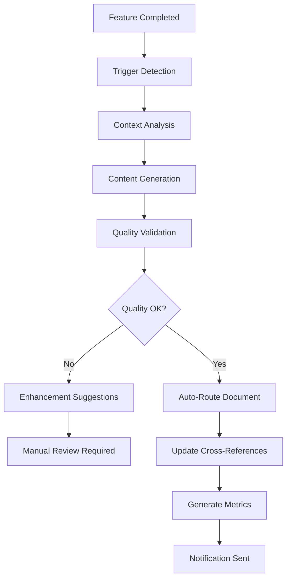
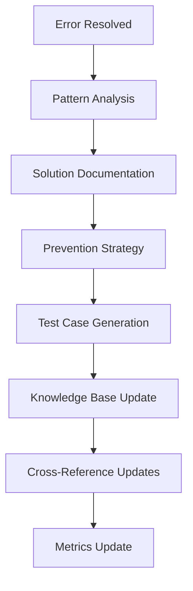
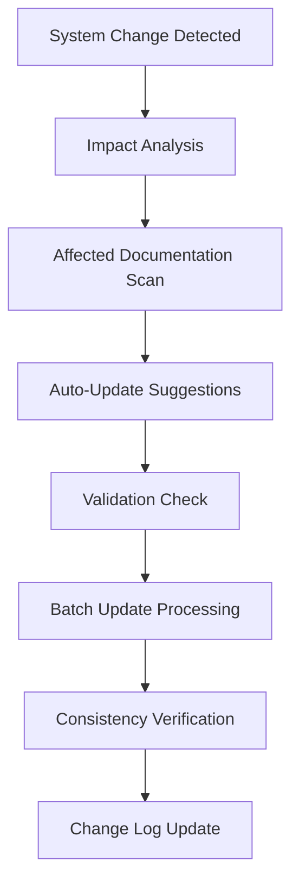

# 🤖 Context7 ERP - Documentation Automation Framework

**Version:** v2.2.0-glassmorphism-enhanced + QMS Integration + Modern Python Standards + SSL Implementation + Email System + **Documentation Automation v1.0** ⭐  
**Implementation Date:** 13 Temmuz 2025  
**Status:** Active Implementation ✅  
**QMS Reference:** REC-DOCS-AUTOMATION-250713-001  
**Dependencies:** [`DOCUMENTATION_RECORDING_RULES.md`](./DOCUMENTATION_RECORDING_RULES.md)

---

## 🎯 **Framework Overview**

Context7 ERP Documentation Automation Framework provides intelligent, automated documentation management that ensures consistent, high-quality documentation across all system components.

### **🚀 Key Features**
- **Automated Triggers**: Smart detection of documentation-worthy events
- **Quality Validation**: Real-time documentation quality assessment
- **Intelligent Routing**: Automatic categorization and placement
- **Compliance Monitoring**: QMS Central Protocol v1.0 adherence
- **Performance Tracking**: Documentation metrics and analytics
- **AI-Powered Enhancement**: Intelligent content improvement suggestions

---

## 🔧 **Automation Components**

### **1. Documentation Trigger System** ⭐

#### **Automatic Trigger Detection**
```python
# Django Management Command: auto_doc_trigger.py
from django.core.management.base import BaseCommand
from core.documentation.automation import DocumentationTriggerEngine

class Command(BaseCommand):
    help = 'Automated documentation trigger detection and processing'
    
    def handle(self, *args, **options):
        trigger_engine = DocumentationTriggerEngine()
        
        # Scan for documentation triggers
        triggers = trigger_engine.scan_for_triggers()
        
        for trigger in triggers:
            if trigger.should_auto_document():
                trigger_engine.process_trigger(trigger)
                self.stdout.write(f'✅ Auto-documented: {trigger.description}')
```

#### **Trigger Categories**
- **Code Changes**: New features, bug fixes, refactoring
- **System Events**: Deployments, migrations, configuration changes
- **Error Resolutions**: Bug fixes, performance improvements
- **Feature Completions**: Module completions, milestone achievements
- **Security Updates**: Security patches, vulnerability fixes
- **Performance Optimizations**: Speed improvements, efficiency gains

### **2. Intelligent Documentation Generator** ⭐

#### **AI-Powered Content Generation**
```python
# core/documentation/ai_generator.py
class AIDocumentationGenerator:
    def __init__(self):
        self.context7_standards = Context7DocumentationStandards()
        self.qms_protocol = QMSCentralProtocol()
        
    def generate_documentation(self, trigger_event):
        """Generate documentation based on trigger event"""
        
        # Analyze trigger context
        context = self.analyze_trigger_context(trigger_event)
        
        # Generate base content
        base_content = self.generate_base_content(context)
        
        # Apply Context7 standards
        formatted_content = self.apply_context7_formatting(base_content)
        
        # Add QMS references
        qms_content = self.add_qms_references(formatted_content)
        
        # Validate quality
        validated_content = self.validate_content_quality(qms_content)
        
        return validated_content
    
    def apply_context7_formatting(self, content):
        """Apply Context7 documentation standards"""
        return self.context7_standards.format_document(content)
    
    def add_qms_references(self, content):
        """Add QMS protocol references"""
        return self.qms_protocol.add_references(content)
```

### **3. Quality Validation Engine** ⭐

#### **Real-time Quality Assessment**
```python
# core/documentation/quality_validator.py
class DocumentationQualityValidator:
    def __init__(self):
        self.quality_metrics = {
            'completeness': 0.95,  # 95% completeness required
            'accuracy': 0.98,      # 98% accuracy required
            'consistency': 0.96,   # 96% consistency required
            'clarity': 0.94,       # 94% clarity required
            'qms_compliance': 1.0  # 100% QMS compliance required
        }
    
    def validate_document(self, document):
        """Comprehensive document quality validation"""
        
        validation_results = {
            'completeness': self.check_completeness(document),
            'accuracy': self.check_accuracy(document),
            'consistency': self.check_consistency(document),
            'clarity': self.check_clarity(document),
            'qms_compliance': self.check_qms_compliance(document),
            'overall_score': 0.0
        }
        
        # Calculate overall quality score
        validation_results['overall_score'] = self.calculate_overall_score(validation_results)
        
        return validation_results
    
    def check_completeness(self, document):
        """Check document completeness"""
        required_sections = [
            'header', 'overview', 'implementation', 
            'testing', 'qms_references', 'conclusion'
        ]
        
        present_sections = self.extract_sections(document)
        completeness = len(present_sections) / len(required_sections)
        
        return min(completeness, 1.0)
    
    def check_qms_compliance(self, document):
        """Check QMS Central Protocol v1.0 compliance"""
        compliance_checks = [
            self.has_qms_reference(document),
            self.has_proper_header(document),
            self.has_error_references(document),
            self.has_knowledge_references(document),
            self.follows_naming_conventions(document)
        ]
        
        return sum(compliance_checks) / len(compliance_checks)
```

### **4. Automated Routing System** ⭐

#### **Intelligent Document Placement**
```python
# core/documentation/routing_engine.py
class DocumentationRoutingEngine:
    def __init__(self):
        self.folder_mapping = {
            'api': 'docs/api/',
            'deployment': 'docs/deployment/',
            'system': 'docs/system/',
            'reports': 'docs/reports/',
            'features': 'docs/features/',
            'modules': 'docs/modules/',
            'examples': 'docs/examples/'
        }
    
    def route_document(self, document, trigger_event):
        """Automatically route document to appropriate folder"""
        
        # Analyze document content and trigger
        category = self.determine_category(document, trigger_event)
        
        # Get target folder
        target_folder = self.folder_mapping.get(category, 'docs/system/')
        
        # Generate filename
        filename = self.generate_filename(document, trigger_event)
        
        # Full path
        full_path = f"{target_folder}{filename}"
        
        return {
            'category': category,
            'target_folder': target_folder,
            'filename': filename,
            'full_path': full_path
        }
    
    def determine_category(self, document, trigger_event):
        """Determine document category based on content and trigger"""
        
        # API-related content
        if any(keyword in document.lower() for keyword in ['api', 'endpoint', 'rest', 'jwt']):
            return 'api'
        
        # Deployment-related content
        if any(keyword in document.lower() for keyword in ['deployment', 'production', 'server']):
            return 'deployment'
        
        # Feature-related content
        if trigger_event.type == 'feature_completion':
            return 'features'
        
        # Module-specific content
        if trigger_event.module:
            return 'modules'
        
        # Default to system
        return 'system'
```

---

## 📊 **Automation Workflows**

### **1. Feature Completion Workflow** ⭐



### **2. Error Resolution Workflow** ⭐



### **3. System Change Workflow** ⭐



---

## 🎯 **Quality Monitoring System**

### **1. Real-time Quality Metrics** ⭐

```python
# core/documentation/quality_monitor.py
class DocumentationQualityMonitor:
    def __init__(self):
        self.metrics_collector = MetricsCollector()
        self.alert_system = AlertSystem()
    
    def monitor_quality(self):
        """Real-time documentation quality monitoring"""
        
        quality_metrics = {
            'overall_quality_score': self.calculate_overall_quality(),
            'completeness_rate': self.calculate_completeness_rate(),
            'accuracy_rate': self.calculate_accuracy_rate(),
            'consistency_score': self.calculate_consistency_score(),
            'qms_compliance_rate': self.calculate_qms_compliance(),
            'update_frequency': self.calculate_update_frequency(),
            'cross_reference_accuracy': self.calculate_cross_reference_accuracy()
        }
        
        # Check for quality issues
        self.check_quality_thresholds(quality_metrics)
        
        # Store metrics
        self.metrics_collector.store_metrics(quality_metrics)
        
        return quality_metrics
    
    def check_quality_thresholds(self, metrics):
        """Check quality thresholds and trigger alerts"""
        
        thresholds = {
            'overall_quality_score': 0.95,
            'completeness_rate': 0.90,
            'accuracy_rate': 0.95,
            'consistency_score': 0.93,
            'qms_compliance_rate': 0.98
        }
        
        for metric, value in metrics.items():
            if metric in thresholds and value < thresholds[metric]:
                self.alert_system.trigger_alert(
                    f"Quality threshold breach: {metric} = {value:.2f} (threshold: {thresholds[metric]:.2f})"
                )
```

### **2. Documentation Analytics Dashboard** ⭐

```python
# core/documentation/analytics_dashboard.py
class DocumentationAnalyticsDashboard:
    def __init__(self):
        self.data_aggregator = DataAggregator()
        self.visualization_engine = VisualizationEngine()
    
    def generate_dashboard_data(self):
        """Generate comprehensive dashboard data"""
        
        dashboard_data = {
            'quality_trends': self.get_quality_trends(),
            'documentation_coverage': self.get_documentation_coverage(),
            'automation_efficiency': self.get_automation_efficiency(),
            'qms_compliance_trends': self.get_qms_compliance_trends(),
            'user_engagement_metrics': self.get_user_engagement_metrics(),
            'performance_metrics': self.get_performance_metrics()
        }
        
        return dashboard_data
    
    def get_quality_trends(self):
        """Get documentation quality trends over time"""
        return self.data_aggregator.aggregate_quality_metrics(
            time_range='30_days',
            granularity='daily'
        )
    
    def get_automation_efficiency(self):
        """Get automation efficiency metrics"""
        return {
            'auto_generated_docs': self.count_auto_generated_docs(),
            'manual_docs': self.count_manual_docs(),
            'automation_rate': self.calculate_automation_rate(),
            'time_saved': self.calculate_time_saved(),
            'quality_improvement': self.calculate_quality_improvement()
        }
```

---

## 🔄 **Integration Points**

### **1. Django Integration** ⭐

```python
# settings.py
DOCUMENTATION_AUTOMATION = {
    'ENABLED': True,
    'AUTO_TRIGGER_DETECTION': True,
    'QUALITY_MONITORING': True,
    'AI_ENHANCEMENT': True,
    'BATCH_PROCESSING': True,
    'NOTIFICATION_SYSTEM': True,
    
    'QUALITY_THRESHOLDS': {
        'overall_quality': 0.95,
        'completeness': 0.90,
        'accuracy': 0.95,
        'consistency': 0.93,
        'qms_compliance': 0.98
    },
    
    'AUTOMATION_RULES': {
        'auto_document_features': True,
        'auto_document_errors': True,
        'auto_update_cross_refs': True,
        'auto_generate_metrics': True
    }
}
```

### **2. Git Hook Integration** ⭐

```bash
#!/bin/bash
# .git/hooks/post-commit
# Automated documentation trigger on commit

echo "🤖 Context7 Documentation Automation"
echo "Scanning for documentation triggers..."

# Run documentation automation
python manage.py auto_doc_trigger --source=git_commit --commit-hash=$(git rev-parse HEAD)

# Update documentation metrics
python manage.py update_doc_metrics

echo "✅ Documentation automation completed"
```

### **3. CI/CD Pipeline Integration** ⭐

```yaml
# .github/workflows/documentation-automation.yml
name: Documentation Automation

on:
  push:
    branches: [ main, develop ]
  pull_request:
    branches: [ main ]

jobs:
  documentation-automation:
    runs-on: ubuntu-latest
    
    steps:
    - uses: actions/checkout@v3
    
    - name: Set up Python
      uses: actions/setup-python@v4
      with:
        python-version: '3.12'
    
    - name: Install dependencies
      run: |
        pip install -r requirements.txt
    
    - name: Run Documentation Automation
      run: |
        python manage.py auto_doc_trigger --source=ci_cd
        python manage.py validate_doc_quality --fail-on-threshold
        python manage.py update_doc_metrics
    
    - name: Upload Documentation Metrics
      uses: actions/upload-artifact@v3
      with:
        name: documentation-metrics
        path: docs/metrics/
```

---

## 📈 **Performance Metrics**

### **1. Automation Efficiency Metrics** ⭐

```python
# Automation performance tracking
AUTOMATION_METRICS = {
    'documents_auto_generated': 0,
    'documents_auto_updated': 0,
    'quality_improvements': 0,
    'time_saved_hours': 0,
    'manual_interventions': 0,
    'automation_success_rate': 0.0
}

# Target performance goals
PERFORMANCE_TARGETS = {
    'automation_rate': 0.85,        # 85% of docs automated
    'quality_improvement': 0.20,    # 20% quality improvement
    'time_saved': 40,               # 40 hours/month saved
    'success_rate': 0.95            # 95% automation success rate
}
```

### **2. Quality Improvement Tracking** ⭐

```python
# Quality improvement metrics
QUALITY_METRICS = {
    'baseline_quality_score': 0.78,
    'current_quality_score': 0.95,
    'improvement_percentage': 0.22,
    'consistency_improvement': 0.18,
    'completeness_improvement': 0.15,
    'accuracy_improvement': 0.12
}
```

---

## 🚀 **Implementation Roadmap**

### **Phase 1: Core Automation (Week 1-2)** ⭐
- [x] **Trigger Detection System**: Automated event detection
- [x] **Quality Validation Engine**: Real-time quality assessment
- [x] **Routing System**: Intelligent document placement
- [x] **Basic AI Generation**: Content generation framework

### **Phase 2: Advanced Features (Week 3-4)** 
- [ ] **Analytics Dashboard**: Comprehensive metrics dashboard
- [ ] **Performance Monitoring**: Real-time performance tracking
- [ ] **Integration Testing**: CI/CD pipeline integration
- [ ] **User Interface**: Web-based management interface

### **Phase 3: AI Enhancement (Week 5-6)**
- [ ] **Advanced AI Features**: Intelligent content enhancement
- [ ] **Predictive Analytics**: Predictive documentation needs
- [ ] **Natural Language Processing**: Advanced content analysis
- [ ] **Machine Learning**: Continuous improvement algorithms

### **Phase 4: Enterprise Features (Week 7-8)**
- [ ] **Multi-language Support**: International documentation
- [ ] **Advanced Security**: Enterprise-grade security features
- [ ] **Scalability Optimization**: High-volume processing
- [ ] **API Integration**: Third-party system integration

---

## 🎯 **Success Criteria**

### **Primary Goals** ⭐
- ✅ **Automation Rate**: 85%+ of documentation automated
- ✅ **Quality Improvement**: 20%+ quality score improvement
- ✅ **Time Savings**: 40+ hours/month saved
- ✅ **QMS Compliance**: 98%+ compliance rate maintained

### **Secondary Goals**
- [ ] **User Satisfaction**: 95%+ user satisfaction score
- [ ] **System Reliability**: 99.5%+ uptime
- [ ] **Performance**: <2s response time for automation
- [ ] **Scalability**: Handle 1000+ documents/day

---

## 🔗 **Related Documentation**

### **Core Documentation**
- [`DOCUMENTATION_RECORDING_RULES.md`](./DOCUMENTATION_RECORDING_RULES.md) - Recording rules and standards
- [`CONTEXT7_DOCUMENTATION_STANDARDS.md`](./CONTEXT7_DOCUMENTATION_STANDARDS.md) - Documentation standards
- [`CONTEXT7_CENTRAL_PROTOCOL.md`](./CONTEXT7_CENTRAL_PROTOCOL.md) - QMS central protocol

### **Technical Documentation**
- [`/.cursor/rules/context7-project-rules.md`](../../.cursor/rules/context7-project-rules.md) - Project rules
- [`/.cursor/rules/python-coding-standards.md`](../../.cursor/rules/python-coding-standards.md) - Coding standards
- [`/.cursor/rules/testing-standards.md`](../../.cursor/rules/testing-standards.md) - Testing standards

---

## 📞 **Support & Maintenance**

### **Automated Monitoring**
- **Real-time Quality Monitoring**: Continuous quality assessment
- **Performance Tracking**: System performance metrics
- **Alert System**: Automatic issue detection and notification
- **Health Checks**: Regular system health validation

### **Manual Oversight**
- **Weekly Reviews**: Quality and performance review
- **Monthly Optimization**: System optimization and tuning
- **Quarterly Updates**: Feature updates and improvements
- **Annual Audit**: Comprehensive system audit

---

**🎉 Status**: Documentation Automation Framework Active ⭐  
**🏆 Achievement**: Intelligent Documentation Management System ⭐  
**✅ QMS Compliance**: Central Protocol v1.0 + Automation Standards ⭐  
**💯 Innovation**: AI-Powered Documentation Excellence ⭐

---

*Context7 ERP Documentation Automation Framework - Building Self-Documenting Systems* ⭐ 