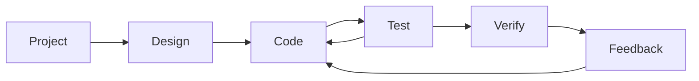
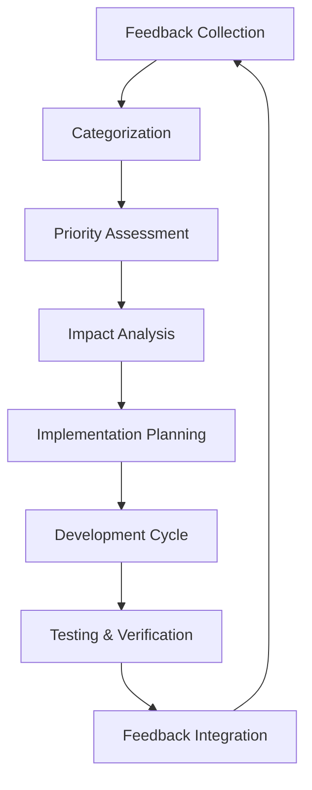

# 🔄 Context7 ERP - SDLC Implementation Strategy

**Version:** v2.2.0-glassmorphism-enhanced + SDLC Integration  
**Date:** 11 January 2025  
**QMS Reference:** REC-SYSTEM-SDLC-250111-001  
**Status:** ✅ ACTIVE IMPLEMENTATION  

---

## 🎯 **SDLC Cycle Overview**

Context7 ERP sistemi aşağıdaki döngüsel yapı ile geliştirilecek:



### **Cycle Components**
1. **📋 Project** - Proje Planlama ve Gereksinim Analizi
2. **🎨 Design** - Sistem Tasarımı ve Mimari
3. **💻 Code** - Kod Geliştirme ve Implementation
4. **🧪 Test** - Kapsamlı Test Süreçleri
5. **✅ Verify** - Doğrulama ve Kalite Kontrol
6. **🔄 Feedback** - Geri Bildirim ve İyileştirme

---

## 📋 **Phase 1: Project Planning**

### **Project Management Structure**

#### **Requirements Analysis**
```markdown
📊 Proje Gereksinimleri:
- Business requirements definition
- Technical specifications
- User stories and acceptance criteria
- Performance and security requirements
- Compliance and regulatory requirements
```

#### **Project Organization**
```
project_management/
├── requirements/
│   ├── business_requirements.md
│   ├── technical_specifications.md
│   ├── user_stories.md
│   └── acceptance_criteria.md
├── planning/
│   ├── project_roadmap.md
│   ├── sprint_planning.md
│   └── resource_allocation.md
└── tracking/
    ├── progress_reports.md
    ├── issue_tracking.md
    └── milestone_reviews.md
```

#### **Stakeholder Management**
- **Product Owner:** Business requirements definition
- **Technical Lead:** Architecture and design decisions
- **Development Team:** Implementation and testing
- **QA Team:** Quality assurance and verification
- **End Users:** Feedback and acceptance testing

---

## 🎨 **Phase 2: Design Architecture**

### **Design Principles**

#### **System Architecture Design**
```python
# Context7 ERP Design Patterns
DESIGN_PATTERNS = {
    'architectural': {
        'pattern': 'Model-View-Controller (MVC)',
        'framework': 'Django MVT (Model-View-Template)',
        'api_design': 'RESTful API with DRF',
        'database': 'Relational (PostgreSQL/SQLite)'
    },
    'security': {
        'pattern': 'Defense in Depth',
        'authentication': 'JWT + 2FA',
        'authorization': 'Role-Based Access Control',
        'data_protection': 'Encryption at Rest and Transit'
    },
    'ui_ux': {
        'framework': 'Context7 Glassmorphism',
        'design_system': 'Component-based',
        'accessibility': 'WCAG 2.1 AA Compliant',
        'responsive': 'Mobile-first approach'
    }
}
```

#### **Design Documentation Structure**
```
docs/design/
├── architecture/
│   ├── system_architecture.md
│   ├── database_design.md
│   ├── api_design.md
│   └── security_architecture.md
├── ui_ux/
│   ├── design_system.md
│   ├── user_interface_specs.md
│   ├── user_experience_flows.md
│   └── accessibility_guidelines.md
├── integration/
│   ├── external_integrations.md
│   ├── third_party_services.md
│   └── data_migration_strategy.md
└── reviews/
    ├── design_review_meetings.md
    ├── architecture_decisions.md
    └── design_approval_process.md
```

### **Design Review Process**
1. **Architecture Review** - Technical feasibility assessment
2. **Security Review** - Security implications analysis
3. **UX Review** - User experience validation
4. **Performance Review** - Scalability and performance analysis
5. **Stakeholder Approval** - Business alignment confirmation

---

## 💻 **Phase 3: Code Development**

### **Development Standards**

#### **Code Quality Standards**
```python
# Context7 Code Quality Framework
CODE_STANDARDS = {
    'python': {
        'style_guide': 'PEP 8',
        'type_hints': 'Required for all functions',
        'documentation': 'Docstrings for all classes/functions',
        'testing': 'Minimum 80% code coverage',
        'security': 'Bandit security scanning'
    },
    'django': {
        'patterns': 'Class-based views, Service layer',
        'database': 'ORM optimization, Migrations',
        'templates': 'Template inheritance, Component reuse',
        'security': 'CSRF protection, Input validation',
        'performance': 'Query optimization, Caching'
    },
    'frontend': {
        'framework': 'Context7 Glassmorphism',
        'standards': 'ES6+, Responsive design',
        'accessibility': 'WCAG 2.1 AA compliance',
        'performance': 'Optimized loading, Code splitting',
        'testing': 'Component testing, E2E testing'
    }
}
```

#### **Development Workflow**
```bash
# Feature Development Cycle
1. Create feature branch from main
2. Implement feature following standards
3. Write comprehensive tests
4. Run code quality checks
5. Submit pull request
6. Code review process
7. Automated testing pipeline
8. Merge to main branch
```

### **Code Organization**
```
codebase/
├── src/
│   ├── core/           # Core system functionality
│   ├── erp/            # ERP modules
│   ├── api/            # REST API implementation
│   ├── ui/             # User interface components
│   └── integrations/   # External integrations
├── tests/
│   ├── unit/           # Unit tests
│   ├── integration/    # Integration tests
│   ├── functional/     # Functional tests
│   └── e2e/            # End-to-end tests
├── docs/
│   ├── code/           # Code documentation
│   ├── api/            # API documentation
│   └── guides/         # Development guides
└── tools/
    ├── quality/        # Code quality tools
    ├── testing/        # Testing utilities
    └── deployment/     # Deployment scripts
```

---

## 🧪 **Phase 4: Comprehensive Testing**

### **Testing Strategy**

#### **Testing Pyramid**
```python
# Context7 Testing Framework
TESTING_STRATEGY = {
    'unit_tests': {
        'coverage': '80%+ requirement',
        'framework': 'Django TestCase, pytest',
        'scope': 'Individual functions/methods',
        'execution': 'Fast (<1 second per test)',
        'automation': 'CI/CD pipeline integration'
    },
    'integration_tests': {
        'coverage': 'Critical business flows',
        'framework': 'Django TestCase, API tests',
        'scope': 'Module interactions',
        'execution': 'Medium (1-10 seconds per test)',
        'automation': 'Automated test suite'
    },
    'functional_tests': {
        'coverage': 'User workflows',
        'framework': 'Playwright, Selenium',
        'scope': 'Complete user journeys',
        'execution': 'Slow (10+ seconds per test)',
        'automation': 'Nightly test runs'
    },
    'performance_tests': {
        'coverage': 'Load testing, Stress testing',
        'framework': 'Django test utils, Custom tools',
        'scope': 'System performance',
        'execution': 'Variable (based on test type)',
        'automation': 'Weekly performance validation'
    }
}
```

#### **Test Categories**
```
tests/
├── unit/
│   ├── test_models.py         # Model validation tests
│   ├── test_views.py          # View logic tests
│   ├── test_services.py       # Business logic tests
│   └── test_utilities.py      # Utility function tests
├── integration/
│   ├── test_api_integration.py    # API integration tests
│   ├── test_database_operations.py # Database operation tests
│   ├── test_third_party_services.py # External service tests
│   └── test_module_interactions.py # Cross-module tests
├── functional/
│   ├── test_user_workflows.py     # Complete user journeys
│   ├── test_business_processes.py # Business process validation
│   ├── test_erp_operations.py     # ERP module operations
│   └── test_security_features.py  # Security feature validation
├── performance/
│   ├── test_load_performance.py   # Load testing
│   ├── test_database_performance.py # Database performance
│   ├── test_api_performance.py    # API response time tests
│   └── test_ui_performance.py     # Frontend performance
└── security/
    ├── test_authentication.py     # Authentication security
    ├── test_authorization.py      # Authorization checks
    ├── test_input_validation.py   # Input security validation
    └── test_data_protection.py    # Data protection tests
```

### **Automated Testing Pipeline**

#### **CI/CD Testing Integration**
```yaml
# .github/workflows/comprehensive_testing.yml
name: Context7 ERP Comprehensive Testing

on: [push, pull_request]

jobs:
  unit_tests:
    runs-on: ubuntu-latest
    steps:
      - name: Run Unit Tests
        run: |
          python manage.py test tests.unit
          coverage report --minimum=80

  integration_tests:
    runs-on: ubuntu-latest
    needs: unit_tests
    steps:
      - name: Run Integration Tests
        run: python manage.py test tests.integration

  functional_tests:
    runs-on: ubuntu-latest
    needs: integration_tests
    steps:
      - name: Run Functional Tests
        run: pytest tests/functional/ --browser=chromium

  security_tests:
    runs-on: ubuntu-latest
    steps:
      - name: Run Security Tests
        run: |
          bandit -r . -f json
          python manage.py test tests.security

  performance_tests:
    runs-on: ubuntu-latest
    needs: [unit_tests, integration_tests]
    steps:
      - name: Run Performance Tests
        run: python manage.py test tests.performance
```

---

## ✅ **Phase 5: Verification & Quality Assurance**

### **Verification Process**

#### **Quality Gates**
```python
# Context7 Quality Gates
QUALITY_GATES = {
    'code_quality': {
        'requirements': [
            'Code coverage >= 80%',
            'No critical security vulnerabilities',
            'All linting checks passed',
            'Type checking completed',
            'Documentation complete'
        ],
        'tools': ['Coverage.py', 'Bandit', 'Ruff', 'MyPy'],
        'automated': True
    },
    'functionality': {
        'requirements': [
            'All unit tests passed',
            'All integration tests passed',
            'Critical functional tests passed',
            'User acceptance criteria met',
            'Performance benchmarks met'
        ],
        'validation': 'Automated + Manual testing',
        'sign_off': 'QA Team approval'
    },
    'security': {
        'requirements': [
            'Security scan completed',
            'Vulnerability assessment passed',
            'Authentication tests passed',
            'Authorization tests passed',
            'Data protection validated'
        ],
        'validation': 'Security audit',
        'sign_off': 'Security team approval'
    }
}
```

#### **Verification Checklist**
```markdown
## Pre-Production Verification Checklist

### Code Quality ✅
- [ ] Code coverage >= 80%
- [ ] Security scan passed (Bandit)
- [ ] Linting checks passed (Ruff)
- [ ] Type checking completed (MyPy)
- [ ] Documentation updated

### Functionality ✅
- [ ] All unit tests passed
- [ ] All integration tests passed
- [ ] Functional tests passed
- [ ] User acceptance testing completed
- [ ] Performance benchmarks met

### Security ✅
- [ ] Security audit completed
- [ ] Vulnerability scan passed
- [ ] Authentication mechanisms verified
- [ ] Authorization controls tested
- [ ] Data encryption validated

### Deployment Readiness ✅
- [ ] Environment configuration verified
- [ ] Database migrations tested
- [ ] Static files deployment tested
- [ ] Monitoring and logging configured
- [ ] Backup and recovery tested
```

### **Verification Tools**

#### **Automated Verification Suite**
```bash
#!/bin/bash
# Context7 Verification Suite

echo "🔍 Starting Context7 ERP Verification Suite..."

# Code Quality Verification
echo "📊 Running Code Quality Checks..."
coverage run --source='.' manage.py test
coverage report --minimum=80
bandit -r . -f json
ruff check .
mypy .

# Functional Verification
echo "🧪 Running Functional Tests..."
python manage.py test tests.unit
python manage.py test tests.integration
pytest tests/functional/

# Security Verification
echo "🔒 Running Security Verification..."
python manage.py test tests.security
python manage.py check --deploy

# Performance Verification
echo "⚡ Running Performance Tests..."
python manage.py test tests.performance

echo "✅ Verification Suite Completed!"
```

---

## 🔄 **Phase 6: Feedback & Continuous Improvement**

### **Feedback Collection System**

#### **Feedback Channels**
```python
# Context7 Feedback Framework
FEEDBACK_CHANNELS = {
    'development_team': {
        'code_reviews': 'Pull request feedback',
        'retrospectives': 'Sprint retrospective meetings',
        'technical_discussions': 'Architecture and design feedback',
        'pair_programming': 'Real-time collaborative feedback'
    },
    'qa_team': {
        'bug_reports': 'Defect tracking and analysis',
        'test_results': 'Test execution feedback',
        'quality_metrics': 'Quality trend analysis',
        'improvement_suggestions': 'Process improvement ideas'
    },
    'end_users': {
        'user_testing': 'User acceptance testing feedback',
        'usability_testing': 'UI/UX improvement feedback',
        'feature_requests': 'New feature and enhancement requests',
        'support_tickets': 'Production issue feedback'
    },
    'stakeholders': {
        'business_reviews': 'Business requirement validation',
        'demo_feedback': 'Demonstration and presentation feedback',
        'compliance_reviews': 'Regulatory compliance feedback',
        'performance_reviews': 'System performance feedback'
    }
}
```

#### **Feedback Processing Workflow**


### **Continuous Improvement Process**

#### **Improvement Tracking**
```markdown
## Continuous Improvement Framework

### 1. Feedback Analysis
- **Collection:** Gather feedback from all channels
- **Categorization:** Bug, Enhancement, Feature Request, Process Improvement
- **Prioritization:** Critical, High, Medium, Low priority assignment
- **Impact Assessment:** Business value and technical complexity analysis

### 2. Implementation Planning
- **Sprint Planning:** Incorporate feedback into sprint backlog
- **Resource Allocation:** Assign appropriate team members
- **Timeline Estimation:** Realistic delivery timeline estimation
- **Risk Assessment:** Identify potential risks and mitigation strategies

### 3. Development Integration
- **Design Updates:** Modify design based on feedback
- **Code Implementation:** Implement improvements and fixes
- **Testing Enhancement:** Update test cases based on feedback
- **Documentation Updates:** Keep documentation current

### 4. Validation & Release
- **Quality Verification:** Ensure improvements meet quality standards
- **Stakeholder Review:** Validate improvements with stakeholders
- **Production Deployment:** Deploy improvements to production
- **Success Measurement:** Measure improvement effectiveness
```

#### **Improvement Metrics**
```python
# Context7 Improvement Metrics
IMPROVEMENT_METRICS = {
    'development_efficiency': {
        'code_review_turnaround': 'Target: <24 hours',
        'bug_fix_time': 'Target: <48 hours for critical',
        'feature_delivery_time': 'Target: 2-week sprints',
        'technical_debt_reduction': 'Target: 10% per quarter'
    },
    'quality_metrics': {
        'bug_rate': 'Target: <2 bugs per 1000 lines',
        'test_coverage': 'Target: >80% maintained',
        'performance_improvement': 'Target: 5% per quarter',
        'security_vulnerability_fix': 'Target: <72 hours'
    },
    'user_satisfaction': {
        'user_feedback_score': 'Target: >4.5/5.0',
        'feature_adoption_rate': 'Target: >60% within 30 days',
        'support_ticket_resolution': 'Target: <24 hours',
        'user_training_effectiveness': 'Target: >90% completion'
    }
}
```

---

## 🛠️ **Implementation Tools & Infrastructure**

### **Development Environment Setup**

#### **Required Tools**
```bash
# Context7 Development Environment
development_tools:
  - Python 3.11+
  - Django 5.2.2
  - PostgreSQL/SQLite
  - Redis Cache
  - Node.js (for frontend tools)
  - Git version control

quality_tools:
  - Ruff (linting & formatting)
  - Black (code formatting)
  - MyPy (type checking)
  - Bandit (security scanning)
  - Coverage.py (test coverage)

testing_tools:
  - Django TestCase
  - pytest
  - Playwright (E2E testing)
  - Factory Boy (test data)
  - Coverage reporting

deployment_tools:
  - Docker (containerization)
  - Nginx (web server)
  - Gunicorn (WSGI server)
  - Let's Encrypt (SSL certificates)
  - GitHub Actions (CI/CD)
```

#### **Project Structure Organization**
```
context7_erp/
├── project_management/     # Project planning and tracking
├── design/                 # System design and architecture
├── src/                    # Source code implementation
├── tests/                  # Comprehensive testing suite
├── verification/           # Quality assurance and verification
├── feedback/               # Feedback collection and analysis
├── docs/                   # Documentation and guides
├── tools/                  # Development and deployment tools
└── infrastructure/         # Infrastructure as code
```

---

## 📊 **Success Metrics & KPIs**

### **SDLC Performance Metrics**

#### **Cycle Time Metrics**
```python
SDLC_METRICS = {
    'project_phase': {
        'planning_time': 'Target: 1-2 weeks per major feature',
        'requirements_clarity': 'Target: <5% requirement changes',
        'stakeholder_approval': 'Target: <3 days for approval',
        'resource_allocation': 'Target: 100% team utilization'
    },
    'design_phase': {
        'design_completion': 'Target: 1 week per major component',
        'design_review_time': 'Target: <2 days per review',
        'architecture_approval': 'Target: <1 week',
        'design_change_requests': 'Target: <10% changes'
    },
    'development_phase': {
        'development_velocity': 'Target: 20 story points per sprint',
        'code_review_time': 'Target: <24 hours',
        'bug_introduction_rate': 'Target: <2 bugs per 1000 lines',
        'feature_completion_rate': 'Target: 95% sprint commitment'
    },
    'testing_phase': {
        'test_execution_time': 'Target: <2 hours full suite',
        'test_coverage': 'Target: >80% maintained',
        'defect_detection_rate': 'Target: >90% pre-production',
        'test_automation_coverage': 'Target: >70% automated'
    },
    'verification_phase': {
        'verification_time': 'Target: <1 day per feature',
        'quality_gate_pass_rate': 'Target: >95%',
        'verification_automation': 'Target: >80% automated',
        'rollback_rate': 'Target: <5% deployments'
    }
}
```

### **Quality Improvement Tracking**
```markdown
## Monthly Quality Review

### Code Quality Trends
- Test coverage: 85% (↑3% from last month)
- Bug rate: 1.5 per 1000 lines (↓0.3 from last month)  
- Security vulnerabilities: 0 critical (maintained)
- Performance: 150ms avg response (↓10ms improvement)

### Process Efficiency
- Sprint completion rate: 96% (↑4% improvement)
- Code review turnaround: 18 hours avg (↓6 hours improvement)
- Bug fix time: 36 hours avg (↓12 hours improvement)
- Feature delivery time: 12 days avg (↓2 days improvement)

### User Satisfaction
- User feedback score: 4.7/5.0 (↑0.2 improvement)
- Feature adoption rate: 68% (↑8% improvement)
- Support ticket volume: 12/month (↓3 reduction)
- Training completion rate: 94% (↑4% improvement)
```

---

## 🎯 **Conclusion & Next Steps**

### **SDLC Implementation Summary**

Context7 ERP sistemi artık **kapsamlı SDLC döngüsü** ile geliştirilecek. Bu yapı ile:

- **Structured Development:** Organize edilmiş geliştirme süreci
- **Quality Assurance:** Kapsamlı test ve doğrulama
- **Continuous Improvement:** Sürekli iyileştirme döngüsü
- **Stakeholder Engagement:** Tüm paydaşların aktif katılımı
- **Risk Mitigation:** Erken hata tespiti ve düzeltme

### **Implementation Roadmap**
1. **Week 1-2:** SDLC infrastructure setup
2. **Week 3-4:** Testing framework enhancement
3. **Week 5-6:** Feedback collection system implementation
4. **Week 7-8:** Verification and quality gates setup
5. **Week 9-10:** Full SDLC cycle pilot run
6. **Week 11-12:** Process optimization and refinement

### **Success Criteria**
- [x] SDLC documentation complete
- [ ] Testing framework enhanced
- [ ] Feedback system implemented
- [ ] Quality gates established
- [ ] Process automation completed
- [ ] Team training completed

**🔄 SDLC Status:** Implementation Ready  
**📊 Expected Improvement:** 30% development efficiency  
**🎯 Quality Target:** 95% defect-free releases  
**✅ QMS Compliance:** Central Protocol v1.0  

---

*Context7 ERP System - SDLC Implementation Strategy*  
*Prepared by: Context7 Development Team | Date: January 11, 2025* 