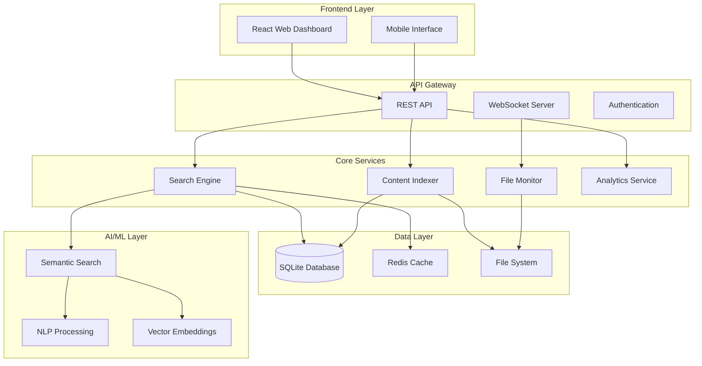
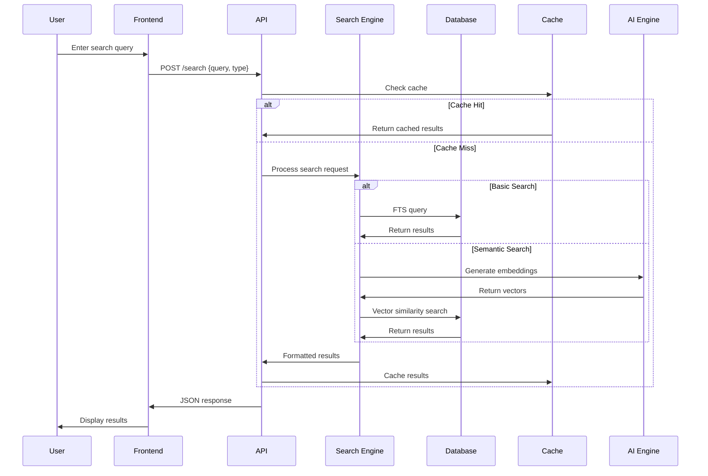
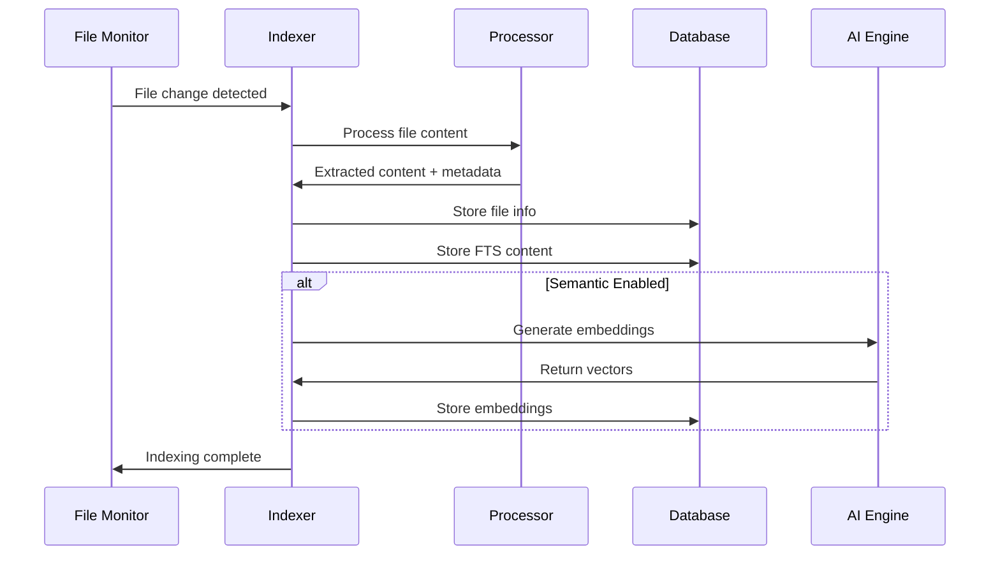

# Collective Memory v2.1 Architecture

Bu dokümantasyon Collective Memory v2.1'in sistem mimarisini, bileşenlerini ve teknoloji yığınını detaylandırır.

## 🏗️ High-Level Architecture



## 🔧 System Components

### 1. Frontend Layer

#### React Web Dashboard
```
frontend/
├── src/
│   ├── components/           # React components
│   │   ├── Dashboard.jsx    # Main dashboard
│   │   ├── SearchPanel.jsx  # Search interface
│   │   ├── Analytics.jsx    # Analytics page
│   │   └── Settings.jsx     # Configuration
│   ├── hooks/               # Custom React hooks
│   │   ├── useSearch.js     # Search functionality
│   │   ├── useSystemStatus.js # System monitoring
│   │   └── useDebounce.js   # Utility hooks
│   ├── services/            # API services
│   │   └── api.js          # API client
│   └── main.jsx            # Application entry
├── public/                  # Static assets
└── package.json            # Dependencies
```

**Technology Stack:**
- **React 18.3.1**: Component-based UI
- **Vite**: Build tool and dev server
- **Tailwind CSS**: Utility-first CSS
- **Framer Motion**: Animations
- **React Query**: Data fetching
- **Lucide Icons**: Icon library

#### Component Architecture

```javascript
// Component hierarchy
App
├── Router
├── Header
│   ├── Navigation
│   ├── SystemStatus
│   └── ThemeToggle
├── Sidebar
│   ├── Navigation
│   └── QuickStats
└── Main
    ├── Dashboard
    │   ├── StatsCards
    │   ├── SearchPanel
    │   ├── QuickActions
    │   └── RecentActivity
    ├── SearchResults
    │   ├── SearchForm
    │   ├── Filters
    │   ├── ResultsList
    │   └── Pagination
    ├── Analytics
    │   ├── PerformanceMetrics
    │   ├── Charts
    │   └── Reports
    └── Settings
        ├── GeneralSettings
        ├── SearchSettings
        └── SystemSettings
```

### 2. Backend API Layer

#### Flask REST API Server
```
api_server.py                # Main API server
src/
├── database/               # Database operations
│   ├── __init__.py
│   ├── models.py          # SQLite models
│   └── migrations.py      # Schema updates
├── search/                # Search engine
│   ├── __init__.py
│   ├── basic_search.py    # Text-based search
│   ├── semantic_search.py # AI-powered search
│   └── query_processor.py # Query analysis
├── indexing/             # Content indexing
│   ├── __init__.py
│   ├── file_indexer.py   # File processing
│   ├── content_analyzer.py # Content analysis
│   └── scheduler.py      # Indexing scheduler
├── monitoring/           # System monitoring
│   ├── __init__.py
│   ├── file_monitor.py   # File system watcher
│   ├── system_monitor.py # System metrics
│   └── health_check.py   # Health monitoring
└── utils/               # Utilities
    ├── __init__.py
    ├── config.py        # Configuration
    ├── logging.py       # Logging setup
    └── helpers.py       # Helper functions
```

**Technology Stack:**
- **Flask 3.1.1**: Web framework
- **Flask-CORS**: Cross-origin requests
- **Flask-SocketIO**: WebSocket support
- **SQLite**: Embedded database
- **Watchdog**: File system monitoring
- **psutil**: System monitoring

#### API Architecture

```python
# API endpoint structure
/api/v1/
├── search/
│   ├── POST /search           # Main search
│   ├── GET /suggestions       # Autocomplete
│   └── POST /export          # Export results
├── system/
│   ├── GET /status           # System health
│   ├── GET /stats            # System statistics
│   ├── GET /indexing         # Indexing status
│   ├── POST /indexing/start  # Start indexing
│   ├── POST /indexing/stop   # Stop indexing
│   └── POST /cache/clear     # Clear cache
└── config/
    ├── GET /config           # Get configuration
    └── PUT /config           # Update configuration
```

### 3. Core Services

#### Search Engine

```python
class SearchEngine:
    def __init__(self):
        self.basic_search = BasicSearchEngine()
        self.semantic_search = SemanticSearchEngine()
        self.query_processor = QueryProcessor()
    
    def search(self, query, search_type='basic', **kwargs):
        """Main search interface"""
        processed_query = self.query_processor.process(query)
        
        if search_type == 'semantic':
            return self.semantic_search.search(processed_query, **kwargs)
        else:
            return self.basic_search.search(processed_query, **kwargs)
```

**Search Types:**

1. **Basic Search (FTS)**:
   - SQLite FTS5 full-text search
   - Boolean operators (AND, OR, NOT)
   - Wildcard support (*, ?)
   - Phrase matching ("exact phrase")
   - Field-specific search

2. **Semantic Search (AI)**:
   - Sentence Transformers embeddings
   - Vector similarity search
   - Context-aware matching
   - Relevance scoring
   - Multi-language support

#### Content Indexer

```python
class ContentIndexer:
    def __init__(self):
        self.file_processors = {
            '.py': PythonProcessor(),
            '.js': JavaScriptProcessor(),
            '.md': MarkdownProcessor(),
            '.txt': TextProcessor(),
            '.json': JSONProcessor()
        }
    
    def index_directory(self, path):
        """Index all files in directory"""
        for file_path in self.discover_files(path):
            self.index_file(file_path)
    
    def index_file(self, file_path):
        """Index single file"""
        processor = self.get_processor(file_path)
        content = processor.extract_content(file_path)
        metadata = processor.extract_metadata(file_path)
        
        self.store_in_database(file_path, content, metadata)
        
        if self.semantic_enabled:
            self.generate_embeddings(content)
```

**Supported File Types:**
- **Code**: `.py`, `.js`, `.ts`, `.java`, `.cpp`, `.c`, `.go`
- **Documentation**: `.md`, `.rst`, `.txt`, `.pdf`
- **Data**: `.json`, `.xml`, `.csv`, `.yaml`
- **Web**: `.html`, `.css`, `.scss`

#### File Monitor

```python
class FileMonitor:
    def __init__(self, indexer):
        self.indexer = indexer
        self.observer = Observer()
        self.handlers = {}
    
    def watch_directory(self, path):
        """Start monitoring directory for changes"""
        handler = IndexingEventHandler(self.indexer)
        self.observer.schedule(handler, path, recursive=True)
        self.handlers[path] = handler
    
    def on_modified(self, event):
        """Handle file modification"""
        if not event.is_directory:
            self.indexer.reindex_file(event.src_path)
    
    def on_created(self, event):
        """Handle file creation"""
        if not event.is_directory:
            self.indexer.index_file(event.src_path)
    
    def on_deleted(self, event):
        """Handle file deletion"""
        if not event.is_directory:
            self.indexer.remove_from_index(event.src_path)
```

### 4. Data Layer

#### Database Schema

```sql
-- Files table
CREATE TABLE files (
    id INTEGER PRIMARY KEY AUTOINCREMENT,
    path TEXT UNIQUE NOT NULL,
    filename TEXT NOT NULL,
    file_type TEXT NOT NULL,
    size_bytes INTEGER NOT NULL,
    modified_date DATETIME NOT NULL,
    created_date DATETIME NOT NULL,
    content_hash TEXT NOT NULL,
    indexed_date DATETIME DEFAULT CURRENT_TIMESTAMP
);

-- Full-text search index
CREATE VIRTUAL TABLE files_fts USING fts5(
    filename,
    content,
    tags,
    content='files',
    content_rowid='id'
);

-- Semantic embeddings
CREATE TABLE embeddings (
    file_id INTEGER REFERENCES files(id),
    vector BLOB NOT NULL,
    model_name TEXT NOT NULL,
    created_date DATETIME DEFAULT CURRENT_TIMESTAMP
);

-- Search history
CREATE TABLE search_history (
    id INTEGER PRIMARY KEY AUTOINCREMENT,
    query TEXT NOT NULL,
    search_type TEXT NOT NULL,
    results_count INTEGER NOT NULL,
    response_time_ms INTEGER NOT NULL,
    timestamp DATETIME DEFAULT CURRENT_TIMESTAMP
);

-- System settings
CREATE TABLE settings (
    key TEXT PRIMARY KEY,
    value TEXT NOT NULL,
    updated_date DATETIME DEFAULT CURRENT_TIMESTAMP
);
```

#### Database Operations

```python
class DatabaseManager:
    def __init__(self, db_path):
        self.db_path = db_path
        self.connection_pool = ConnectionPool(max_connections=10)
    
    def add_file(self, file_info):
        """Add file to index"""
        with self.get_connection() as conn:
            conn.execute("""
                INSERT OR REPLACE INTO files 
                (path, filename, file_type, size_bytes, modified_date, created_date, content_hash)
                VALUES (?, ?, ?, ?, ?, ?, ?)
            """, file_info)
    
    def search_files(self, query, limit=50):
        """Search files using FTS"""
        with self.get_connection() as conn:
            return conn.execute("""
                SELECT files.*, rank
                FROM files_fts 
                JOIN files ON files.id = files_fts.rowid
                WHERE files_fts MATCH ?
                ORDER BY rank DESC
                LIMIT ?
            """, (query, limit)).fetchall()
```

#### Caching Strategy

```python
class CacheManager:
    def __init__(self, cache_type='memory'):
        if cache_type == 'redis':
            self.cache = RedisCache()
        else:
            self.cache = MemoryCache()
    
    def get_search_results(self, query_hash):
        """Get cached search results"""
        return self.cache.get(f"search:{query_hash}")
    
    def cache_search_results(self, query_hash, results, ttl=1800):
        """Cache search results for 30 minutes"""
        self.cache.set(f"search:{query_hash}", results, ttl)
    
    def invalidate_file_cache(self, file_path):
        """Invalidate cache for specific file"""
        self.cache.delete_pattern(f"file:{file_path}:*")
```

### 5. AI/ML Layer

#### Semantic Search Engine

```python
class SemanticSearchEngine:
    def __init__(self, model_name='all-MiniLM-L6-v2'):
        self.model = SentenceTransformer(model_name)
        self.vector_store = VectorStore()
    
    def generate_embeddings(self, texts):
        """Generate embeddings for texts"""
        return self.model.encode(texts, convert_to_tensor=True)
    
    def search(self, query, threshold=0.7, limit=50):
        """Perform semantic search"""
        query_embedding = self.generate_embeddings([query])
        
        # Vector similarity search
        results = self.vector_store.similarity_search(
            query_embedding, 
            threshold=threshold, 
            limit=limit
        )
        
        return self.format_results(results)
```

#### Vector Storage

```python
class VectorStore:
    def __init__(self, dimension=384):
        self.dimension = dimension
        self.index = self.create_index()
    
    def create_index(self):
        """Create FAISS index for vector similarity"""
        import faiss
        return faiss.IndexFlatIP(self.dimension)
    
    def add_vectors(self, vectors, ids):
        """Add vectors to index"""
        self.index.add(vectors.numpy())
        self.id_mapping.extend(ids)
    
    def search_vectors(self, query_vector, k=50):
        """Search similar vectors"""
        scores, indices = self.index.search(query_vector.numpy(), k)
        return [(self.id_mapping[idx], score) 
                for idx, score in zip(indices[0], scores[0])]
```

## 🔄 Data Flow

### Search Request Flow



### File Indexing Flow



## 🚀 Performance Architecture

### Scalability Considerations

#### Horizontal Scaling

```python
# Load balancer configuration
class LoadBalancer:
    def __init__(self):
        self.backends = [
            'http://api-1:5000',
            'http://api-2:5000',
            'http://api-3:5000'
        ]
        self.current = 0
    
    def get_backend(self):
        """Round-robin load balancing"""
        backend = self.backends[self.current]
        self.current = (self.current + 1) % len(self.backends)
        return backend
```

#### Database Sharding

```python
class ShardedDatabase:
    def __init__(self, shards):
        self.shards = shards
    
    def get_shard(self, file_path):
        """Determine shard based on file path hash"""
        hash_value = hash(file_path)
        return self.shards[hash_value % len(self.shards)]
    
    def search_all_shards(self, query):
        """Search across all shards"""
        results = []
        for shard in self.shards:
            results.extend(shard.search(query))
        return self.merge_results(results)
```

### Caching Strategy

#### Multi-Level Caching

```python
class MultiLevelCache:
    def __init__(self):
        self.l1_cache = MemoryCache(max_size=1000)      # Hot data
        self.l2_cache = RedisCache()                     # Warm data
        self.l3_cache = DiskCache()                      # Cold data
    
    def get(self, key):
        # L1 Cache (Memory)
        value = self.l1_cache.get(key)
        if value:
            return value
        
        # L2 Cache (Redis)
        value = self.l2_cache.get(key)
        if value:
            self.l1_cache.set(key, value)
            return value
        
        # L3 Cache (Disk)
        value = self.l3_cache.get(key)
        if value:
            self.l2_cache.set(key, value)
            self.l1_cache.set(key, value)
            return value
        
        return None
```

## 🔐 Security Architecture

### Authentication & Authorization

```python
class SecurityManager:
    def __init__(self):
        self.jwt_secret = os.environ.get('JWT_SECRET')
        self.rate_limiter = RateLimiter()
    
    def authenticate_request(self, request):
        """Authenticate API request"""
        token = request.headers.get('Authorization')
        if not token:
            raise UnauthorizedException()
        
        try:
            payload = jwt.decode(token, self.jwt_secret, algorithms=['HS256'])
            return payload['user_id']
        except jwt.InvalidTokenError:
            raise UnauthorizedException()
    
    def check_rate_limit(self, ip_address, endpoint):
        """Check rate limiting"""
        key = f"{ip_address}:{endpoint}"
        if self.rate_limiter.is_exceeded(key):
            raise RateLimitExceededException()
```

### Data Protection

```python
class DataProtection:
    def __init__(self):
        self.encryption_key = self.load_encryption_key()
    
    def encrypt_sensitive_data(self, data):
        """Encrypt sensitive content"""
        fernet = Fernet(self.encryption_key)
        return fernet.encrypt(data.encode())
    
    def anonymize_logs(self, log_data):
        """Remove PII from logs"""
        # Remove file paths, user names, etc.
        return self.sanitize_data(log_data)
```

## 📊 Monitoring & Observability

### Metrics Collection

```python
class MetricsCollector:
    def __init__(self):
        self.prometheus = PrometheusMetrics()
        self.custom_metrics = {}
    
    def track_search_performance(self, query, response_time, results_count):
        """Track search metrics"""
        self.prometheus.search_duration.observe(response_time)
        self.prometheus.search_results.observe(results_count)
        
        # Custom metrics
        self.custom_metrics['avg_search_time'] = (
            self.custom_metrics.get('avg_search_time', 0) * 0.9 + 
            response_time * 0.1
        )
```

### Health Monitoring

```python
class HealthMonitor:
    def __init__(self):
        self.checks = [
            DatabaseHealthCheck(),
            SearchEngineHealthCheck(),
            FileSystemHealthCheck(),
            MemoryHealthCheck()
        ]
    
    def get_system_health(self):
        """Comprehensive system health check"""
        results = {}
        overall_health = True
        
        for check in self.checks:
            try:
                status = check.perform_check()
                results[check.name] = status
                if not status['healthy']:
                    overall_health = False
            except Exception as e:
                results[check.name] = {
                    'healthy': False,
                    'error': str(e)
                }
                overall_health = False
        
        return {
            'overall_healthy': overall_health,
            'components': results,
            'timestamp': datetime.utcnow().isoformat()
        }
```

## 🔮 Future Architecture

### Microservices Migration

```yaml
# Future microservices architecture
services:
  api-gateway:
    image: collective-memory/api-gateway
    ports: ["8080:8080"]
  
  search-service:
    image: collective-memory/search-service
    replicas: 3
  
  indexing-service:
    image: collective-memory/indexing-service
    replicas: 2
  
  ai-service:
    image: collective-memory/ai-service
    replicas: 2
    gpu: true
  
  analytics-service:
    image: collective-memory/analytics-service
    replicas: 1
```

### Event-Driven Architecture

```python
class EventBus:
    def __init__(self):
        self.subscribers = {}
    
    def publish(self, event_type, data):
        """Publish event to subscribers"""
        for subscriber in self.subscribers.get(event_type, []):
            subscriber.handle_event(data)
    
    def subscribe(self, event_type, handler):
        """Subscribe to event type"""
        if event_type not in self.subscribers:
            self.subscribers[event_type] = []
        self.subscribers[event_type].append(handler)

# Event types
class Events:
    FILE_INDEXED = 'file.indexed'
    SEARCH_PERFORMED = 'search.performed'
    USER_LOGIN = 'user.login'
    SYSTEM_ERROR = 'system.error'
```

## 📈 Performance Metrics

### Current Benchmarks

| Metric | Performance |
|--------|-------------|
| Search Response Time | < 100ms (95th percentile) |
| Indexing Speed | 850+ files/minute |
| Memory Usage | < 200MB (idle) |
| Storage Efficiency | 2-5MB per 1000 files |
| Cache Hit Rate | 85-95% |
| Concurrent Users | 100+ |

### Optimization Strategies

1. **Database Optimization**:
   - Proper indexing strategy
   - Query optimization
   - Connection pooling

2. **Search Optimization**:
   - Result caching
   - Query preprocessing
   - Parallel processing

3. **AI/ML Optimization**:
   - Model quantization
   - Batch processing
   - GPU acceleration

4. **Frontend Optimization**:
   - Code splitting
   - Lazy loading
   - Service workers

---

**Bu architecture dokümantasyonu Collective Memory v2.1'in teknik altyapısını detaylandırır ve gelecekteki geliştirmeler için rehber niteliğindedir.** 🏗️ 