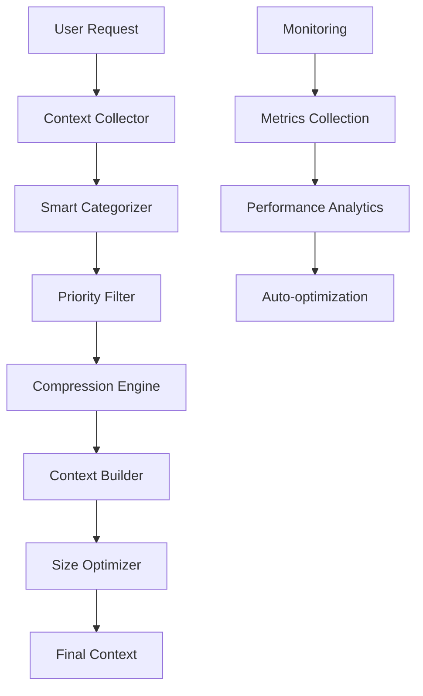

# 🏗️ Context Management Architecture

**Technical documentation for context optimization and smart filing system**

## 🧠 **Architecture Overview**

### 📊 **Context Pipeline Architecture**



### 🔧 **Core Components**

#### **1. Context Collector**
```python
class ContextCollector:
    """Advanced context collection with optimization"""
    
    def __init__(self):
        self.max_context_length = 8000
        self.compression_engine = CompressionEngine()
        self.categorizer = SmartCategorizer()
        self.priority_filter = PriorityFilter()
        
    async def collect_optimized_context(self, request):
        """Optimized context collection pipeline"""
        
        # Phase 1: Raw collection
        raw_context = await self.collect_raw_context(request)
        
        # Phase 2: Categorization
        categorized = self.categorizer.categorize(raw_context)
        
        # Phase 3: Priority filtering
        prioritized = self.priority_filter.filter(categorized)
        
        # Phase 4: Compression
        compressed = self.compression_engine.compress(prioritized)
        
        # Phase 5: Final optimization
        optimized = self.optimize_final_context(compressed)
        
        return optimized
```

#### **2. Smart Categorizer**
```python
class SmartCategorizer:
    """AI-powered content categorization"""
    
    CATEGORIES = {
        "CRITICAL": {"priority": 1, "max_size": 2000},
        "IMPORTANT": {"priority": 2, "max_size": 1500},
        "USEFUL": {"priority": 3, "max_size": 1000},
        "REFERENCE": {"priority": 4, "max_size": 500}
    }
    
    def categorize(self, content_items):
        """Categorize content based on importance and relevance"""
        
        categorized = []
        
        for item in content_items:
            # Analyze content type
            content_type = self.analyze_content_type(item)
            
            # Calculate importance score
            importance = self.calculate_importance_score(item)
            
            # Assess context relevance
            relevance = self.assess_context_relevance(item)
            
            # Determine category
            category = self.determine_category(content_type, importance, relevance)
            
            categorized.append({
                "content": item,
                "category": category,
                "priority": self.CATEGORIES[category]["priority"],
                "max_size": self.CATEGORIES[category]["max_size"],
                "importance_score": importance,
                "relevance_score": relevance
            })
        
        return sorted(categorized, key=lambda x: x["priority"])
```

#### **3. Compression Engine**
```python
class CompressionEngine:
    """Advanced text compression with semantic preservation"""
    
    def __init__(self):
        self.summarizer = SemanticSummarizer()
        self.structure_preserver = StructurePreserver()
        
    def compress(self, categorized_content):
        """Multi-level compression strategy"""
        
        compressed_items = []
        
        for item in categorized_content:
            target_size = item["max_size"]
            current_size = len(item["content"])
            
            if current_size <= target_size:
                # No compression needed
                compressed_items.append(item)
            else:
                # Apply compression
                compression_ratio = target_size / current_size
                
                if compression_ratio >= 0.8:
                    # Light compression - remove redundancy
                    compressed = self.remove_redundancy(item["content"])
                elif compression_ratio >= 0.5:
                    # Medium compression - smart truncation
                    compressed = self.smart_truncation(item["content"], target_size)
                else:
                    # Heavy compression - semantic summarization
                    compressed = self.summarizer.summarize(item["content"], target_size)
                
                item["content"] = compressed
                item["compressed"] = True
                item["compression_ratio"] = len(compressed) / current_size
                compressed_items.append(item)
        
        return compressed_items
```

## 📊 **Memory Management**

### 🧮 **Memory Allocation Strategy**

```python
class ContextMemoryManager:
    """Manages memory allocation for context processing"""
    
    def __init__(self):
        self.memory_pools = {
            "critical": MemoryPool(size_mb=50),
            "important": MemoryPool(size_mb=30),
            "useful": MemoryPool(size_mb=20),
            "cache": MemoryPool(size_mb=30)
        }
        
        self.allocation_strategy = {
            "CRITICAL": {"pool": "critical", "max_allocation": 0.8},
            "IMPORTANT": {"pool": "important", "max_allocation": 0.7},
            "USEFUL": {"pool": "useful", "max_allocation": 0.6},
            "REFERENCE": {"pool": "cache", "max_allocation": 0.5}
        }
    
    def allocate_memory(self, content_category, content_size):
        """Allocate memory based on content category"""
        
        strategy = self.allocation_strategy[content_category]
        pool = self.memory_pools[strategy["pool"]]
        max_alloc = strategy["max_allocation"]
        
        if pool.available_space() * max_alloc >= content_size:
            return pool.allocate(content_size)
        else:
            # Trigger garbage collection and retry
            self.garbage_collect(strategy["pool"])
            if pool.available_space() * max_alloc >= content_size:
                return pool.allocate(content_size)
            else:
                raise MemoryAllocationError(f"Insufficient memory for {content_category}")
```

### 🔄 **Caching Architecture**

```python
class ContextCache:
    """Multi-level caching for context optimization"""
    
    def __init__(self):
        self.l1_cache = LRUCache(max_size="10MB")  # Hot data
        self.l2_cache = LRUCache(max_size="20MB")  # Warm data
        self.l3_cache = LRUCache(max_size="20MB")  # Cold data
        
        self.cache_levels = {
            "hot": {"cache": self.l1_cache, "ttl": 300},    # 5 min
            "warm": {"cache": self.l2_cache, "ttl": 1800},  # 30 min
            "cold": {"cache": self.l3_cache, "ttl": 7200}   # 2 hours
        }
    
    def get_cached_context(self, context_key):
        """Multi-level cache lookup"""
        
        # Try L1 cache first
        if context_key in self.l1_cache:
            self.l1_cache.promote(context_key)  # LRU promotion
            return self.l1_cache.get(context_key)
        
        # Try L2 cache
        if context_key in self.l2_cache:
            value = self.l2_cache.get(context_key)
            self.l1_cache.put(context_key, value)  # Promote to L1
            return value
        
        # Try L3 cache
        if context_key in self.l3_cache:
            value = self.l3_cache.get(context_key)
            self.l2_cache.put(context_key, value)  # Promote to L2
            return value
        
        return None
    
    def cache_context(self, context_key, context_data, access_frequency):
        """Store context in appropriate cache level"""
        
        if access_frequency >= 0.8:
            cache_level = "hot"
        elif access_frequency >= 0.5:
            cache_level = "warm"
        else:
            cache_level = "cold"
        
        cache_info = self.cache_levels[cache_level]
        cache_info["cache"].put(context_key, context_data)
```

## ⚡ **Performance Optimization**

### 🚀 **Parallel Processing**

```python
class ParallelContextProcessor:
    """Parallel processing for context optimization"""
    
    def __init__(self, max_workers=4):
        self.executor = ThreadPoolExecutor(max_workers=max_workers)
        self.process_pool = ProcessPoolExecutor(max_workers=2)
    
    async def process_context_parallel(self, context_items):
        """Process multiple context items in parallel"""
        
        # Group items by processing type
        cpu_intensive = [item for item in context_items if self.is_cpu_intensive(item)]
        io_intensive = [item for item in context_items if self.is_io_intensive(item)]
        
        # Process CPU-intensive tasks in process pool
        cpu_futures = [
            self.process_pool.submit(self.process_cpu_intensive, item)
            for item in cpu_intensive
        ]
        
        # Process IO-intensive tasks in thread pool
        io_futures = [
            self.executor.submit(self.process_io_intensive, item)
            for item in io_intensive
        ]
        
        # Wait for all tasks to complete
        cpu_results = [future.result() for future in cpu_futures]
        io_results = [future.result() for future in io_futures]
        
        return cpu_results + io_results
```

### 📈 **Performance Metrics**

```python
class PerformanceMonitor:
    """Real-time performance monitoring"""
    
    def __init__(self):
        self.metrics = defaultdict(list)
        self.alerts = []
        
    def track_context_operation(self, operation_name, duration, memory_usage):
        """Track context operation performance"""
        
        self.metrics[operation_name].append({
            "duration": duration,
            "memory_usage": memory_usage,
            "timestamp": datetime.now()
        })
        
        # Check for performance alerts
        self.check_performance_alerts(operation_name, duration, memory_usage)
    
    def get_performance_summary(self):
        """Get comprehensive performance summary"""
        
        summary = {}
        
        for operation, data in self.metrics.items():
            if data:
                durations = [d["duration"] for d in data]
                memory_usages = [d["memory_usage"] for d in data]
                
                summary[operation] = {
                    "avg_duration": sum(durations) / len(durations),
                    "max_duration": max(durations),
                    "avg_memory": sum(memory_usages) / len(memory_usages),
                    "max_memory": max(memory_usages),
                    "operation_count": len(data)
                }
        
        return summary
```

## 🔧 **Configuration Management**

### ⚙️ **Dynamic Configuration**

```python
class ContextConfiguration:
    """Dynamic context configuration management"""
    
    def __init__(self):
        self.config = self.load_default_config()
        self.adaptive_tuning = True
        
    def load_default_config(self):
        return {
            "context_limits": {
                "max_context_length": 8000,
                "max_rules_per_query": 10,
                "max_chats_per_query": 5,
                "max_docs_per_query": 10,
                "max_doc_content_length": 1500,
                "max_rule_content_length": 2000
            },
            "optimization": {
                "compression_enabled": True,
                "categorization_enabled": True,
                "parallel_processing": True,
                "caching_enabled": True,
                "min_relevance_score": 0.6
            },
            "performance": {
                "target_response_time": 100,  # ms
                "max_memory_usage": 150,      # MB
                "cache_hit_target": 0.8,     # 80%
                "compression_target": 0.6    # 60%
            }
        }
    
    def adapt_configuration(self, performance_metrics):
        """Adaptively tune configuration based on performance"""
        
        if not self.adaptive_tuning:
            return
        
        avg_response_time = performance_metrics.get("avg_response_time", 0)
        memory_usage = performance_metrics.get("memory_usage", 0)
        cache_hit_rate = performance_metrics.get("cache_hit_rate", 0)
        
        # Adapt based on performance
        if avg_response_time > self.config["performance"]["target_response_time"]:
            # Reduce context size to improve response time
            self.config["context_limits"]["max_context_length"] *= 0.9
            self.config["context_limits"]["max_docs_per_query"] = max(5, 
                self.config["context_limits"]["max_docs_per_query"] - 1)
        
        if memory_usage > self.config["performance"]["max_memory_usage"]:
            # Reduce memory usage
            self.config["context_limits"]["max_doc_content_length"] *= 0.9
            self.config["optimization"]["min_relevance_score"] = min(0.8,
                self.config["optimization"]["min_relevance_score"] + 0.1)
        
        if cache_hit_rate < self.config["performance"]["cache_hit_target"]:
            # Improve caching
            self.increase_cache_size()
            self.adjust_cache_policy()
```

## 📊 **Monitoring and Analytics**

### 📈 **Real-time Dashboard**

```python
class ContextAnalyticsDashboard:
    """Real-time context analytics and monitoring"""
    
    def __init__(self):
        self.metrics_collector = MetricsCollector()
        self.alert_manager = AlertManager()
        
    def get_real_time_metrics(self):
        """Get current context system metrics"""
        
        return {
            "context_usage": {
                "current_size": self.get_current_context_size(),
                "utilization_percentage": self.get_utilization_percentage(),
                "compression_ratio": self.get_compression_ratio(),
                "cache_hit_rate": self.get_cache_hit_rate()
            },
            "performance": {
                "avg_response_time": self.get_avg_response_time(),
                "memory_usage": self.get_memory_usage(),
                "cpu_usage": self.get_cpu_usage(),
                "throughput": self.get_throughput()
            },
            "optimization": {
                "categorization_accuracy": self.get_categorization_accuracy(),
                "relevance_filtering_effectiveness": self.get_relevance_effectiveness(),
                "compression_efficiency": self.get_compression_efficiency(),
                "deduplication_savings": self.get_deduplication_savings()
            }
        }
    
    def generate_optimization_recommendations(self):
        """Generate actionable optimization recommendations"""
        
        metrics = self.get_real_time_metrics()
        recommendations = []
        
        # Analyze metrics and generate recommendations
        if metrics["context_usage"]["utilization_percentage"] > 90:
            recommendations.append({
                "type": "WARNING",
                "message": "Context utilization is very high",
                "action": "Consider increasing compression ratio or reducing content limits",
                "priority": "HIGH"
            })
        
        if metrics["performance"]["avg_response_time"] > 150:
            recommendations.append({
                "type": "PERFORMANCE",
                "message": "Response time is above target",
                "action": "Enable parallel processing or reduce context size",
                "priority": "MEDIUM"
            })
        
        return recommendations
```

---

## 🎯 **Implementation Checklist**

### ✅ **Phase 1: Core Architecture**
- [ ] Implement ContextCollector with optimization
- [ ] Build SmartCategorizer with AI-powered categorization
- [ ] Create CompressionEngine with semantic preservation
- [ ] Setup ContextMemoryManager

### ✅ **Phase 2: Performance Optimization**
- [ ] Implement ParallelContextProcessor
- [ ] Setup multi-level ContextCache
- [ ] Create PerformanceMonitor
- [ ] Build adaptive configuration system

### ✅ **Phase 3: Monitoring & Analytics**
- [ ] Create real-time metrics dashboard
- [ ] Implement alert system
- [ ] Build optimization recommendation engine
- [ ] Setup automated performance tuning

### ✅ **Phase 4: Integration**
- [ ] Integrate with Smart Context Bridge
- [ ] Update configuration management
- [ ] Deploy monitoring systems
- [ ] Validate performance improvements

---

**🚀 This architecture provides a robust foundation for context optimization with intelligent filing, categorization, and dynamic adaptation based on performance metrics.** 